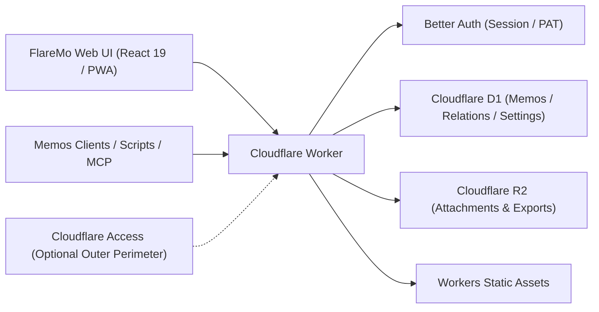

<div dir="rtl">

# FlareMo 🔥

<p align="center">
  <b>بدون خوادم · تكلفة صيانة صفرية · متاح عالمياً على مدار الساعة · تحكم وسيادة كاملة في بياناتك</b><br>
  للأفراد: مساحة هادئة لتدوين الأفكار وعقل ثانٍ مدعوم بالذكاء الاصطناعي. ولفرق العمل: قاعدة معرفية مشتركة مع إدارة دقيقة للأدوار والصلاحيات.
</p>

<p align="center">
  <a href="./README.md">English</a> •
  <a href="./README.zh-CN.md">简体中文</a> •
  <a href="./README.ja.md">日本語</a> •
  <a href="./README.fr.md">Français</a> •
  <a href="./README.es.md">Español</a> •
  <a href="./README.ko.md">한국어</a> •
  <a href="./README.ru.md">Русский</a> •
  <a href="./README.ar.md"><b>العربية</b></a>
</p>

<p align="center">
  <a href="https://github.com/realchendahuang/FlareMo/stargazers"></a>
  <a href="./LICENSE"></a>
  <a href="https://workers.cloudflare.com/"></a>
  <a href="https://github.com/usememos/memos"></a>
  <a href="https://www.better-auth.com/"></a>
  <a href="https://flaremo.app"></a>
</p>

<div align="center">

| ☀️ سطح المكتب · الوضع الفاتح | 🌙 سطح المكتب · الوضع الداكن | 📱 الهاتف المحمول · متجاوب |
| :---: | :---: | :---: |
|  |  |  |

<sub>لقطات حية لتجربة الاستخدام: تبديل سلس بين الوضعين الفاتح والداكن وتجاوب كامل مع الهواتف الذكية. جميع الميزات المعروضة متصلة بقدرات فعلية في الواجهة الخلفية.</sub>

</div>

---

## 💡 لماذا تختار FlareMo؟

أثبتت أدوات مثل Flomo وMemos القيمة الهائلة للتدوين السريع بلا عوائق والخط الزمني الخالي من التشتت. لكن استضافة نظام تدوين تقليدي ذاتياً تعني عادةً استئجار خادم VPS، وإعداد Docker وPostgreSQL، وكتابة نصوص نسخ احتياطي آلي، والخوف الدائم من أعطال القرص أو العتاد.

يجيب FlareMo عن سؤال أبسط: **هل يمكنك الحصول على قاعدة معرفية تعمل 24/7 ومرونة عالية وتسريع عالمي، من دون أي صيانة خوادم، وباستخدام حساب Cloudflare مجاني فقط؟**

- **Serverless حقيقي**: تعمل الشيفرة والأصول الثابتة على عُقد حافة Cloudflare Workers القريبة منك بزمن استجابة يُقاس بأجزاء الثانية.
- **متانة بمستوى المؤسسات من الصندوق**: تتولى Cloudflare D1 الملاحظات والبيانات الوصفية، بينما تحفظ Cloudflare R2 المرفقات الوسائطية مع نسخ متعددة المناطق.
- **عقل ثانٍ أصيل الذكاء الاصطناعي (AI-Native)**: نقاط نهاية MCP مدمجة ومركز «Agent Memory» يتيحان لوكلاء الذكاء الاصطناعي (Claude، Cursor، Codex، ChatGPT) قراءة تفضيلاتك طويلة المدى وسياقات ذاكرتك وتحديثها.
- **هدوء للفرد وقوة للفريق**: الوضع الافتراضي مساحة شخصية خاصة ومشفّرة، وبمجرد تفعيل وضع الفريق تتحول فوراً إلى بيئة عمل تعاونية بأدوار ورؤية ثلاثية المستويات.
- **بسيط لا ناقص**: تبقى الواجهة هادئة ولكل عنصر تحكم مكانه المستحق — لا زخرفة تصرخ لجذب الانتباه، ولا ميزة مفيدة غائبة.

---

## ✨ المميزات الرئيسية

### 1. تدوين فوري ومراجعة ملهمة
- **دوّن في أجزاء من الثانية**: خط زمني على شكل بطاقات، وسوم، دعم Markdown/GFM، ومعاينات لمرفقات الصور والصوت.
- **بحث سريع كالبرق**: فهرسة نصية كاملة عبر SQLite FTS5 مع معاملات بحث (`has:attachment`، `is:pinned`، `before:YYYY-MM-DD`، `after:YYYY-MM-DD`، `in:timeline|archive|trash`).
- **بحث دلالي «اكتشف» (Vector Search)**: تضمينات Workers AI مقترنة بفهارس Vectorize المشتقة لاستدعاء الملاحظات حسب السياق، مع إعادة التحقق من الصلاحيات مقابل D1 وتراجع سلس إلى FTS5.
- **تنشيط الأفكار**: **مراجعة يومية** مدمجة (في مثل هذا اليوم)، و**مسار عشوائي** (تجوال في شبكات الوسوم والروابط الخلفية مع ملخصات بطاقات بريدية)، واقتراحات ملاحظات ذات صلة.
- **سجل المراجعات**: مقارنة كاملة بين الإصدارات واستعادة أي نسخة سابقة بنقرة واحدة.

### 2. ذاكرة الذكاء الاصطناعي طويلة المدى و MCP أصيل
- **Agent Memory**: عبر `/memory/mcp` يمكن لوكلاء الذكاء الاصطناعي تسجيل الذاكرة طويلة المدى عبر الجلسات وتحديثها (التفضيلات، قرارات المشاريع، القيود، الدروس المستفادة).
- **الإنسان في الحلقة**: راجع الذكريات التي سجّلها الذكاء الاصطناعي وتحقق منها وثبّتها أو صححها عبر `/memory`.
- **نظام بيئي مفتوح**: نقطة نهاية `/mcp` قياسية (Streamable HTTP MCP) للاستعلام عن الملاحظات وإضافتها برمجياً.

### 3. المشاريع والمهام
- **اجمع العمل ضمن المشاريع**: نظّم الملاحظات والمهام في مشاريع، مع لوحة كانبان (سحب بين أعمدة الحالة)، وأولويات، وترتيب يدوي، ومواعيد استحقاق.
- **شخصي بطبعه وحذف قابل للتراجع**: المهام تخص مالكاً واحداً؛ الحذف ينقلها إلى سلة المهملات حتى تُستعاد أو تُمسح تلقائياً.

### 4. إدارة المهام والتذكيرات
- **المهام تعيش في المشاريع**: لوحة `/projects` (سحب بين أعمدة الحالة)، والأولويات، والترتيب اليدوي، ومواعيد الاستحقاق تجعل صفحات المشاريع الموطن الوحيد لجدولة العمل.
- **الأطر الزمنية في لمحة**: تجمع الواجهة الرئيسية للاستكشاف بين تقويم شهري مصغّر وتذكيرات للمتأخر ومهام اليوم، فلا يختبئ ما يستحق بسببك خلف اللوحة.
- **تذكيرات المتأخر**: تُطلق المهام المتأخرة إشعارات داخل التطبيق، مع Web Push اختياري في المتصفح.

### 5. تعاون الفرق والرؤية ثلاثية المستويات
- **حوكمة بالأدوار**: أدوار `owner` و`admin` و`member`. يدعو المسؤولون الأعضاء عبر روابط تفعيل لمرة واحدة (يختار كل عضو كلمة مروره بنفسه؛ ولا يطّلع المسؤولون على أي بيانات دخول صريحة).
- **3 مستويات للرؤية**:
  - 🔒 **خاص**: لا يراه إلا مؤلفه.
  - 👥 **للفريق**: قراءة مشتركة فقط لأعضاء الفريق النشطين.
  - 🌐 **عام**: قراءة مجهولة عبر روابط مشاركة محددة المدة.
- **مغادرة آمنة**: إزالة عضو تطلق تنظيفاً خلفياً موثوقاً يمحو بياناته الخاصة بينما تحتفظ بملاحظات الفريق والعامة.
- **مقاعد قرّاء**: منح مقعد قراءة فقط بمدة محددة — للقرّاء الضيوف، أو دفعات الدورات، أو تسليم العملاء. تنتهي المقاعد تلقائياً عند انتهاء صلاحيتها (فشل مغلق عند حل بيانات الاعتماد، دون حاجة إلى cron). أدرها من صفحة الأعضاء، أو افتحها عبر البريد بواسطة `PUT /api/app/admin/team/reader` مع رمز وصول شخصي (انظر `docs/team-mode.md`).

### 6. أولوية العمل دون اتصال وتجربة PWA
- **PWA قابل للتثبيت**: ثبّته على الشاشة الرئيسية في macOS أو Windows أو iOS أو Android بتجربة تحس كأنها تطبيق أصلي.
- **مزامنة موثوقة دون اتصال**: تُحفظ المسودات محلياً فوراً، وتصطف الإرسالات والملفات المرفوعة دون اتصال في قائمة انتظار تُعاد تلقائياً فور عودة الاتصال.
- **إملاء صوتي حي**: افتح `/capture` لتحويل مباشر للكلام إلى نص (ASR) بالبث في الوقت الفعلي.

### 7. أمان متين عبر Better Auth
- **مدعوم بـ Better Auth**: جلسات كوكيز في المتصفح بخاصيتي `HttpOnly` و`SameSite=Lax`؛ ورموز وصول شخصية `memos_pat_` قابلة للإلغاء للنصوص البرمجية وواجهة سطر الأوامر وMCP.
- **حماية صارمة للـ Origin**: تفرض الطلبات التي تعدّل الحالة قائمة سماح مطابقة تماماً للمصدر. ويبقى Cloudflare Access متاحاً كمحيط دفاعي خارجي اختياري.

### 8. التوافق مع Memos والترحيل السلس
- **توافق `/api/v1` مع Memos**: يوفر نقاط نهاية API الأساسية لـ Memos (بصيغة camelCase افتراضياً، وsnake_case القديمة عبر ترويسة) ومخطط OpenAPI.
- **جاهز لتطبيقات الطرف الثالث**: يعمل مباشرة مع عملاء الهاتف مثل Moe Memos.
- **استيراد وتصدير باتجاهين**: استيراد بنقرة واحدة من Memos / flomo مع استراتيجيات للتعامل مع التعارض، وحزم تصدير خام كاملة.

---

### 9. نظام الإضافات: البطاقات كإضافات
- **خمس بطاقات مدمجة**: عادية، يومية، تذكرة، بطاقة بريدية، إضافة إلى عرض توضيحي «ختم بريدي» مرسوم على canvas.
- **المتجر والتنسيق**: تصفّح الأدلة، وتثبيت بنقرة واحدة (بتحقق SHA-256)، وتفعيل/تعطيل، وإعادة ترتيب، وتعيين البطاقة الافتراضية، والإخفاء — كل ذلك من إعدادات الحساب. الدليل الرسمي متاح على [flaremo.app/plugins](https://flaremo.app/plugins/registry.json).
- **ارفع إضافاتك الخاصة**: يمكن للمديرين تثبيت حزمة محلية — توجد على تلك النسخة فقط ولا تُرسل إلى أي مكان.
- **أدوات التأليف**: `pnpm plugin:new` ينشئ الهيكل، و`pnpm plugin:check` يتحقق وفق **نفس القواعد التي تفرضها النسخ عند التثبيت**، و`pnpm plugins:build` يحزم. بطاقات المستندات تخطيطات JSON صافية؛ وبطاقات sandbox تشغّل HTML/CSS/JS الخاصة بك. راجع [دليل الإضافات](./docs/en/plugins.md).
- **آمنة افتراضياً**: تعمل البطاقات في صندوق رملي بأصل معتم و**من دون أي وصول إلى الشبكة**؛ وتبقى حزم المجتمع والعلامات التجارية معطلة حتى يفعّلها المدير.

## 📊 ما مدى سخاء الخطة المجانية من Cloudflare؟

يظن كثيرون أن «مجاني» يعني «مقيّد بشدة». أما بالنسبة لقاعدة معرفية شخصية يغلب عليها النص، فحصة Cloudflare المجانية تكاد تكون لا تنضب:

| المورد | الحصة المجانية | السعة المكافئة | العمر الافتراضي العملي |
| :--- | :--- | :--- | :--- |
| **Cloudflare D1** | **قاعدة بيانات 5 جيجابايت** | نحو **2.5 مليون** ملاحظة نصية | كتابة 100 ملاحظة يومياً تستغرق **68 عاماً** لملئها |
| **Cloudflare R2** | **تخزين 10 جيجابايت** | نحو **5,000–10,000** صورة / **80 ساعة** صوت | **صفر تكاليف egress**؛ المشاركة العامة لن تُطلق فواتير عرض نطاق |
| **Cloudflare Workers** | حدود طلبات مجانية سخية | أكثر من 300 موقع حافة عالمياً | زمن استجابة بالميلي ثانية في كل مكان دون إقلاع بارد |

---

## 🥊 مقارنة: الحل الأصيل على Cloudflare مقابل NAS منزلي مقابل VPS تقليدي

| البُعد | أصيل على Cloudflare (FlareMo) | NAS منزلي / حاسوب مصغّر | VPS تقليدي |
| :--- | :--- | :--- | :--- |
| **متانة البيانات** | **نسخ متعددة المناطق بمستوى المؤسسات**، بلا أي خطر عطل عتاد | عطل قرص واحد أو انقطاع كهرباء قد يفقدك بياناتك كلها | يعتمد على روتين لقطات ونسخ احتياطي يدوي |
| **الصيانة** | **صفر**: لا تحديثات نظام، ولا Docker compose، ولا صيانة قاعدة بيانات | تحديثات نظام، وعناية بـ Docker، وتنبيهات SMART، وإعدادات موجّه | ترقيات نواة، وترقيعات أمنية، وبرامج مراقبة |
| **زمن الوصول** | **CDN حافة عالمي**، استجابة دون 100ms من أي مكان | يتطلب أنفاق DDNS / frp / Tailscale، ومقيّد بخط المنزل الصاعد | يعتمد على منطقة سحابية واحدة؛ زمن وصول عالٍ عبر الحدود |
| **SSL والنطاقات** | **HTTPS تلقائي** وربط نطاقات مخصصة | إصدار شهادات يدوي وإعداد وكيل عكسي | إعداد Nginx / Caddy وصيانة تجديد Let's Encrypt |
| **التكلفة المالية** | **0$ / شهر** على الخطة المجانية | تكلفة عتاد مسبقة مرتفعة + كهرباء مستمرة | فواتير شهرية / سنوية مستمرة للخادم وعرض النطاق |

---

## 🚀 النشر السريع خلال 5 دقائق

### الطريقة 1: نشر بنقرة واحدة إلى Cloudflare

[](https://deploy.workers.cloudflare.com/?url=https://github.com/realchendahuang/FlareMo)

يستنسخ المستودع إلى حسابك على GitHub ويجهّز D1 وR2 وQueues وVectorize تلقائياً. بعد النشر الأولي، اضبط `FLAREMO_PUBLIC_URL` والأسرار (انظر [docs/en/deploy.md](./docs/en/deploy.md#one-click-deploy-community-supported)). إن جاءت المحاولة الأولى برسالة «Github API Limit Exceeded» فانتظر بضع دقائق وأعد المحاولة.

### الطريقة 2: GitHub Action (استضافة ذاتية عبر fork)

في نسختك المتفرعة (fork)، شغّل سير العمل **Deploy to Cloudflare** من تبويب Actions لتجهيز الموارد ونشر الـ Worker ومزامنة أسرار المصادقة. عمليات الدفع (push) لا تنشر من تلقاء نفسها. انظر [docs/en/github-action-deploy.md](./docs/en/github-action-deploy.md).

### الطريقة 3: النشر بواسطة وكيل ذكاء اصطناعي (موصى بها)

قدّم المستودع إلى وكيل قادر على تنفيذ أوامر الطرفية (مثل Claude Code أو Cursor Agent أو Codex) مع المستند [docs/en/agent-deploy.md](./docs/en/agent-deploy.md):
> «يرجى نشر FlareMo على حسابي في Cloudflare باتباع docs/en/agent-deploy.md».

---

### الطريقة 4: النشر اليدوي في 3 خطوات

#### 1. إنشاء موارد Cloudflare
```bash
pnpm exec wrangler whoami
pnpm exec wrangler d1 create flaremo
pnpm exec wrangler r2 bucket create flaremo-attachments
```

أو شغّل `pnpm provision:remote` بدلاً من ذلك: ينشئ موارد D1 / R2 / Queue / Vectorize الناقصة ويكتب `database_id` الخاص بـ D1 في `wrangler.jsonc` نيابة عنك. وهو أمر idempotent — الموارد القائمة تُتخطى.

#### 2. ضبط الإعدادات والأسرار
```bash
cp wrangler.jsonc.example wrangler.jsonc
```
املأ `database_id` الناتج واضبط `FLAREMO_PUBLIC_URL` على نطاقك الإنتاجي. ثم اضبط الأسرار:
```bash
pnpm exec wrangler secret put BETTER_AUTH_SECRET --config ./wrangler.jsonc
pnpm exec wrangler secret put FLAREMO_BOOTSTRAP_SECRET --config ./wrangler.jsonc
```

#### 3. النشر
```bash
pnpm deploy:dry-run
pnpm deploy
```

(تُشغَّل بوابة `pnpm verify` الكاملة فقط عندما يطلبها المشرف صراحةً.)
افتح نطاقك الإنتاجي على المسار `/setup` وأدخل `FLAREMO_BOOTSTRAP_SECRET` لتهيئة حساب المالك.

أدلة مفصلة: [دليل النشر](./docs/en/deploy.md) · [النشر عبر GitHub Action](./docs/en/github-action-deploy.md) · [دليل التحديث](./docs/en/update.md).

---

## 🧱 البنية المعمارية وحزمة التقنيات



- **بيئة التشغيل**: Cloudflare Workers
- **الواجهة الأمامية**: React 19، Vite، TanStack Router، Tailwind CSS 4، Radix UI
- **قاعدة البيانات**: Cloudflare D1، Drizzle ORM
- **التخزين**: Cloudflare R2
- **المصادقة**: Better Auth (جلسة كوكيز HttpOnly + رمز `memos_pat_` قابل للإلغاء)
- **الذكاء الاصطناعي والبحث**: Workers AI، Vectorize، SQLite FTS5
- **الإضافات**: منصة امتدادات قائمة على الفتحات ([المعيار](./docs/plugin-platform-standard.md)، [الدليل](./docs/en/plugins.md))؛ تعيش الحزم في R2 وتعمل البطاقات في صندوق رملي دون وصول إلى الشبكة

---

## 🌟 سجل النجوم (Star History)

[](https://star-history.com/#realchendahuang/FlareMo&Date)

---

## 📄 الترخيص

مشروع مفتوح المصدر بموجب ترخيص [GNU AGPL-3.0](./LICENSE).
Copyright (c) 2026 realchendahuang.

</div>
