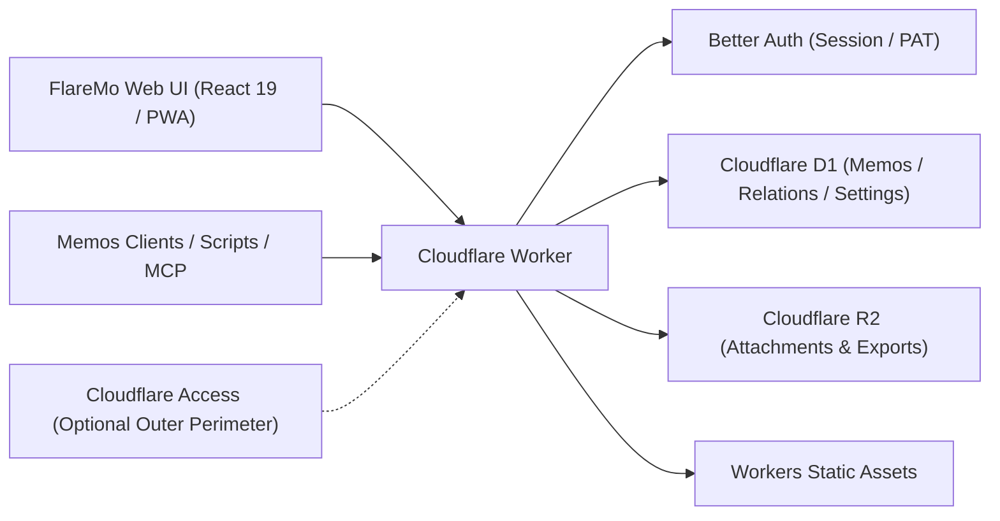

# FlareMo 🔥

<p align="center">
  <b>Cero Servidores · Cero Costes de Mantenimiento · Disponibilidad Global 24/7 en el Edge · Control Absoluto de tus Datos</b><br>
  Para personas: un espacio íntimo de captura de ideas y segundo cerebro con IA. Para equipos: una base de conocimiento compartida con roles detallados.
</p>

<p align="center">
  <a href="./README.md">English</a> •
  <a href="./README.zh-CN.md">简体中文</a> •
  <a href="./README.ja.md">日本語</a> •
  <a href="./README.fr.md">Français</a> •
  <a href="./README.es.md"><b>Español</b></a> •
  <a href="./README.ko.md">한국어</a> •
  <a href="./README.ru.md">Русский</a> •
  <a href="./README.ar.md">العربية</a>
</p>

<p align="center">
  <a href="https://github.com/realchendahuang/FlareMo/stargazers"></a>
  <a href="./LICENSE"></a>
  <a href="https://workers.cloudflare.com/"></a>
  <a href="https://github.com/usememos/memos"></a>
  <a href="https://www.better-auth.com/"></a>
  <a href="https://flaremo.app"></a>
</p>

<div align="center">

| ☀️ Escritorio · Modo Claro | 🌙 Escritorio · Modo Oscuro | 📱 Móvil · Adaptable |
| :---: | :---: | :---: |
|  |  |  |

<sub>Capturas reales de la aplicación: alternancia fluida entre temas claro y oscuro y diseño móvil completamente adaptable. Cada funcionalidad mostrada está conectada al backend.</sub>

</div>

---

## 💡 ¿Por qué elegir FlareMo?

Herramientas como Flomo y Memos han demostrado el inmenso valor de registrar notas sin fricción en una línea de tiempo limpia. Sin embargo, autohospedar un sistema de notas tradicional suele significar pagar un VPS, configurar Docker y PostgreSQL, mantener scripts de respaldo y vivir con el miedo a un fallo de disco o de hardware.

FlareMo responde a una pregunta más simple: **¿Es posible tener una base de conocimiento en línea las 24 horas, resiliente, con aceleración global y sin mantenimiento de servidores, usando solo una cuenta gratuita de Cloudflare?**

- **Auténtico serverless**: El código y los archivos estáticos se ejecutan en los nodos perimetrales (edge) de Cloudflare Workers más cercanos a ti, con latencia de milisegundos.
- **Durabilidad de nivel empresarial desde el primer minuto**: Cloudflare D1 almacena notas y metadatos; Cloudflare R2 guarda los archivos adjuntos con replicación multirregional.
- **Segundo cerebro nativo de IA**: El centro «Agent Memory» incluye un CLI y un skill multiagente para que los agentes de IA (Claude, Cursor, Codex, ChatGPT, ZCode) lean y actualicen tus preferencias y ámbitos de memoria a largo plazo; también hay endpoints MCP disponibles.
- **Silencioso para uno, potente para muchos**: Por defecto es un santuario privado y cifrado de usuario único. Activa el modo de equipo y se transforma al instante en un espacio de trabajo colaborativo con roles y tres niveles de visibilidad.
- **Mínimo, no simplificado**: La interfaz serena y cada control se gana su lugar — nada de decoración estridente, ninguna función útil ausente.

---

## ✨ Características principales

### 1. Captura instantánea y revisión que inspira
- **Captura en milisegundos**: Línea de tiempo en tarjetas, etiquetas, Markdown/GFM y vista previa de imágenes y audios adjuntos.
- **Búsqueda ultrarrápida**: Indexación de texto completo SQLite FTS5 con operadores de consulta (`has:attachment`, `is:pinned`, `before:YYYY-MM-DD`, `after:YYYY-MM-DD`, `in:timeline|archive|trash`).
- **Búsqueda semántica («Find» vectorial)**: Embeddings de Workers AI combinados con índices vectoriales derivados de Vectorize para recordar por contexto; revalida permisos contra D1 y degrada con elegancia a FTS5.
- **Reactivación de ideas**: **Revisión diaria** (un día como hoy), **Paseo aleatorio** (deambular por los grafos de etiquetas y enlaces con resúmenes tipo postal) y sugerencias de notas relacionadas.
- **Historial de versiones**: Comparación completa de versiones y restauración histórica con un solo clic.

### 2. Memoria de IA a largo plazo (CLI + Skills)
- **Agent Memory**: Incluye el CLI `flaremo` y el skill `flaremo-memory` — los agentes de IA registran y actualizan memoria a largo plazo entre sesiones (preferencias, decisiones de proyecto, restricciones, lecciones) sobre una base REST común.
- **Humano en el bucle**: En `/memory` puedes revisar, verificar, fijar o corregir las memorias registradas por la IA.
- **Ecosistema abierto**: La vía recomendada es CLI + Skills; los endpoints `/memory/mcp` (MCP por HTTP en streaming) y `/mcp` siguen disponibles para clientes MCP existentes.

### 3. Proyectos y tareas
- **Agrupa el trabajo por proyectos**: Organiza notas y pendientes en proyectos, con tablero kanban (arrastrar entre columnas de estado), prioridades, orden manual y fechas límite.
- **Privado por diseño, borrado reversible**: Las tareas pertenecen a un solo propietario; al eliminarlas van a la papelera hasta que se restauren o se purguen automáticamente.

### 4. Gestión de tareas y recordatorios
- **Las tareas viven en los proyectos**: El tablero de `/projects` (arrastrar entre columnas de estado), las prioridades, el orden manual y las fechas límite convierten las páginas de proyecto en el único hogar para planificar el trabajo.
- **Horizontes temporales de un vistazo**: La vista de inicio del explorador combina un mini calendario mensual con recordatorios de vencidos y de hoy, para que lo que vence nunca se esconda tras el tablero.
- **Recordatorios de vencidos**: Las tareas atrasadas generan notificaciones dentro de la app, con Web Push opcional en el navegador.

### 5. Colaboración en equipo y visibilidad en 3 niveles
- **Gobernanza por roles**: Roles `owner`, `admin` y `member`. Los administradores invitan a los miembros mediante enlaces de activación de un solo uso (cada miembro elige su propia contraseña; los administradores nunca manejan credenciales en texto plano).
- **3 niveles de visibilidad**:
  - 🔒 **Privado**: Solo visible para el autor.
  - 👥 **Equipo**: Lectura compartida con los miembros activos del equipo.
  - 🌐 **Público**: Lectura anónima mediante enlaces de compartir con tiempo límite.
- **Salida segura**: Al retirar a un miembro se activa una limpieza fiable en segundo plano que purga sus datos privados preservando las notas de equipo y públicas.
- **Asientos de lector**: Concede un asiento de solo lectura por tiempo limitado — lectores invitados, alumnos de un curso, entregas a clientes. Los asientos caducan automáticamente a su vencimiento (fail-closed al resolver la credencial, sin cron). Gestiónalos desde la página de miembros o aprovisiónalos por email mediante `PUT /api/app/admin/team/reader` con un token de acceso personal (ver `docs/team-mode.md`).

### 6. Sin conexión primero y experiencia PWA
- **PWA instalable**: Instala FlareMo en la pantalla de inicio de macOS, Windows, iOS o Android con tacto de app nativa.
- **Sincronización offline fiable**: Los borradores se guardan al instante en local; los envíos y las subidas sin conexión se ponen en cola y se reproducen automáticamente al recuperar la red.
- **Captura de voz en vivo**: Accede a `/capture` para transcripción de voz a texto en streaming en tiempo real (ASR).

### 7. Seguridad robusta con Better Auth
- **Impulsado por Better Auth**: Sesiones por cookie de navegador `HttpOnly` y `SameSite=Lax`; tokens de acceso personal `memos_pat_` revocables para scripts, CLI y MCP.
- **Protección estricta de Origin**: Las peticiones con cambio de estado exigen una lista blanca de origen exacta. Cloudflare Access sigue disponible como perímetro defensivo exterior opcional.

### 8. Compatibilidad con Memos y migración sin costuras
- **Compatibilidad con la API `/api/v1` de Memos**: Proporciona los endpoints principales de la API de Memos (camelCase por defecto, snake_case heredado vía cabecera) y el esquema OpenAPI.
- **Listo para apps de terceros**: Funciona directamente con clientes móviles como Moe Memos.
- **Importación y exportación bidireccionales**: Importación en un clic desde Memos / flomo con estrategias de conflicto y paquetes de exportación completos en formato original.

---

### 9. Sistema de plugins: las tarjetas son plugins
- **Cinco tarjetas incluidas**: Sencilla, Diaria, Billete, Postal y un Matasellos demo dibujado con canvas.
- **Tienda y curación**: explora directorios, instalación en un clic (verificación SHA-256), activar/desactivar, reordenar, fijar la predeterminada, ocultar — todo en los ajustes de cuenta. El directorio oficial vive en [flaremo.app/plugins](https://flaremo.app/plugins/registry.json).
- **Sube los tuyos**: los administradores pueden instalar un paquete local — solo existe en esa instancia y nunca se envía a ningún sitio.
- **Herramientas de autor**: `pnpm plugin:new` genera el esqueleto, `pnpm plugin:check` valida con **exactamente las reglas que las instancias aplican al instalar**, `pnpm plugins:build` empaqueta. Las tarjetas de documento son maquetaciones JSON puras; las tarjetas sandbox ejecutan tu propio HTML/CSS/JS. Ver la [guía de plugins](./docs/en/plugins.md).
- **Seguro por defecto**: las tarjetas se ejecutan en un sandbox de origen opaco y **sin acceso a la red**; los paquetes de comunidad y de marca permanecen desactivados hasta que un administrador los active.

## 📊 ¿Cuán generoso es el plan gratuito de Cloudflare?

Muchos asumen que «gratis» significa «severamente limitado». Para bases de conocimiento personales con mucho texto, la cuota gratuita de Cloudflare es prácticamente inagotable:

| Recurso | Cuota gratuita | Capacidad equivalente | Vida útil práctica |
| :--- | :--- | :--- | :--- |
| **Cloudflare D1** | **Base de datos de 5 GB** | ~**2,5 millones** de notas de texto | Escribiendo 100 notas al día tardarías **68 años** en llenarla |
| **Cloudflare R2** | **10 GB de almacenamiento** | ~**5.000–10.000** fotos / **80 horas** de voz | **0 $ de costes de salida**; compartir en público no genera facturas de ancho de banda |
| **Cloudflare Workers** | Límites generosos de peticiones gratuitas | Más de 300 ubicaciones edge globales | Latencia de milisegundos en todo el mundo sin arranques en frío |

---

## 🥊 Comparativa: Cloudflare nativo vs NAS casero vs VPS tradicional

| Dimensión | Cloudflare nativo (FlareMo) | NAS casero / Mini PC | VPS tradicional |
| :--- | :--- | :--- | :--- |
| **Durabilidad de los datos** | **Replicación multirregional empresarial**, cero riesgo de fallo de hardware | Un fallo de disco o un corte de luz puede suponer la pérdida total de datos | Depende de rutinas manuales de snapshots y copias de seguridad |
| **Mantenimiento** | **Cero**: sin parches de SO, sin Docker compose, sin mantenimiento de BD | Actualizaciones del SO, mantenimiento de Docker, alertas SMART de disco, configuración del router | Actualizaciones de kernel, parches de seguridad, daemons de vigilancia |
| **Latencia de acceso** | **CDN global en el edge**, respuesta de menos de 100 ms en cualquier lugar | Requiere túneles DDNS / frp / Tailscale, limitado por la subida de casa | Depende de una única región cloud; alta latencia transfronteriza |
| **SSL y dominios** | **HTTPS automatizado** y enlace de dominios personalizados | Emisión manual de certificados, configuración de proxy inverso | Configuración de Nginx / Caddy y renovación de Let's Encrypt |
| **Coste económico** | **0 $ / mes** en el plan gratuito | Alto coste inicial de hardware + electricidad continua | Facturas mensuales / anuales continuas de servidor y ancho de banda |

---

## 🚀 Despliegue rápido en 5 minutos

### Método 1: Despliegue en un clic en Cloudflare

[](https://deploy.workers.cloudflare.com/?url=https://github.com/realchendahuang/FlareMo)

Clona el repositorio en tu cuenta de GitHub y aprovisiona automáticamente D1, R2, Queues y Vectorize. Tras el despliegue inicial, configura `FLAREMO_PUBLIC_URL` y los secretos (ver [docs/en/deploy.md](./docs/en/deploy.md#one-click-deploy-community-supported)). Si el primer intento informa de «Github API Limit Exceeded», espera unos minutos y reintenta.

### Método 2: GitHub Action (fork autohospedado)

En tu fork, ejecuta **Deploy to Cloudflare** desde Actions para aprovisionar los recursos, publicar el Worker y sincronizar los secretos de autenticación. Los push no publican. Ver [docs/en/github-action-deploy.md](./docs/en/github-action-deploy.md).

### Método 3: Despliegue con un agente IA (recomendado)

Proporciona este repositorio a un agente capaz de ejecutar comandos de terminal (p. ej. Claude Code, Cursor Agent, Codex) junto con [docs/en/agent-deploy.md](./docs/en/agent-deploy.md):
> «Por favor, despliega FlareMo en mi cuenta de Cloudflare siguiendo docs/en/agent-deploy.md».

---

### Método 4: Despliegue manual en 3 pasos

#### 1. Crear recursos de Cloudflare
```bash
pnpm exec wrangler whoami
pnpm exec wrangler d1 create flaremo
pnpm exec wrangler r2 bucket create flaremo-attachments
```

O ejecuta `pnpm provision:remote` en su lugar: crea los recursos D1 / R2 / Queue / Vectorize que falten y escribe el `database_id` de D1 en `wrangler.jsonc` por ti. Es idempotente — los recursos existentes se omiten.

#### 2. Configurar ajustes y secretos
```bash
cp wrangler.jsonc.example wrangler.jsonc
```
Rellena el `database_id` generado y establece `FLAREMO_PUBLIC_URL` en tu dominio de producción. Después configura los secretos:
```bash
pnpm exec wrangler secret put BETTER_AUTH_SECRET --config ./wrangler.jsonc
pnpm exec wrangler secret put FLAREMO_BOOTSTRAP_SECRET --config ./wrangler.jsonc
```

#### 3. Desplegar
```bash
pnpm deploy:dry-run
pnpm deploy
```

(El gate completo `pnpm verify` solo se ejecuta cuando el mantenedor lo solicita explícitamente.)
Visita `/setup` en tu dominio de producción e introduce el `FLAREMO_BOOTSTRAP_SECRET` para inicializar tu cuenta de Owner.

Guías detalladas: [Guía de despliegue](./docs/en/deploy.md) · [Despliegue con GitHub Action](./docs/en/github-action-deploy.md) · [Guía de actualización](./docs/en/update.md).

---

## 🧱 Arquitectura y stack tecnológico



- **Runtime**: Cloudflare Workers
- **Frontend**: React 19, Vite, TanStack Router, Tailwind CSS 4, Radix UI
- **Base de datos**: Cloudflare D1, Drizzle ORM
- **Almacenamiento**: Cloudflare R2
- **Autenticación**: Better Auth (sesión por cookie HttpOnly + `memos_pat_` revocable)
- **IA y búsqueda**: Workers AI, Vectorize, SQLite FTS5
- **Plugins**: plataforma de extensión basada en slots ([estándar](./docs/plugin-platform-standard.md), [guía](./docs/en/plugins.md)); los paquetes viven en R2 y las tarjetas sandbox se ejecutan sin acceso a la red

---

## 🌟 Star History

[](https://star-history.com/#realchendahuang/FlareMo&Date)

---

## 📄 Licencia

Publicado como código abierto bajo licencia [GNU AGPL-3.0](./LICENSE).
Copyright (c) 2026 realchendahuang.
