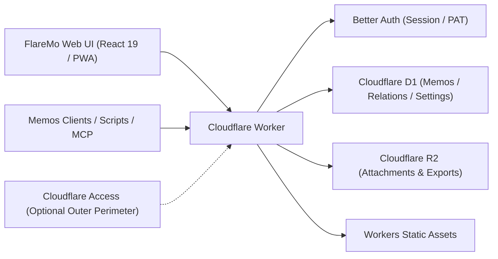

# FlareMo 🔥

<p align="center">
  <b>Zéro serveur · Aucun coût de maintenance · Haute disponibilité globale 24/7 · Maîtrise totale de vos données</b><br>
  Pour les particuliers : un espace de prise de notes intime et second cerveau IA. Pour les équipes : une base de connaissances partagée avec gestion fine des rôles.
</p>

<p align="center">
  <a href="./README.md">English</a> •
  <a href="./README.zh-CN.md">简体中文</a> •
  <a href="./README.ja.md">日本語</a> •
  <a href="./README.fr.md"><b>Français</b></a> •
  <a href="./README.es.md">Español</a> •
  <a href="./README.ko.md">한국어</a> •
  <a href="./README.ru.md">Русский</a> •
  <a href="./README.ar.md">العربية</a>
</p>

<p align="center">
  <a href="https://github.com/realchendahuang/FlareMo/stargazers"></a>
  <a href="./LICENSE"></a>
  <a href="https://workers.cloudflare.com/"></a>
  <a href="https://github.com/usememos/memos"></a>
  <a href="https://www.better-auth.com/"></a>
  <a href="https://flaremo.app"></a>
</p>

<div align="center">

| ☀️ Bureau · Thème Clair | 🌙 Bureau · Thème Sombre | 📱 Mobile · Adaptatif |
| :---: | :---: | :---: |
|  |  |  |

<sub>Captures réelles d'utilisation : transition fluide entre modes clair et sombre, design mobile entièrement réactif. Toutes les fonctionnalités présentées sont reliées au backend.</sub>

</div>

---

## 💡 Pourquoi choisir FlareMo ?

Les outils comme Flomo ou Memos ont démontré la puissance d'une capture d'idées fluide et d'un fil chronologique sans distraction. Cependant, auto-héberger un système traditionnel implique souvent de payer un VPS chaque mois, de configurer Docker et PostgreSQL, d'écrire des scripts de sauvegarde et de redouter la panne d'un disque dur.

FlareMo répond à une question plus simple : **Peut-on obtenir une base de connaissances en ligne 24h/24, résiliente, accélérée mondialement et sans maintenance de serveur, simplement avec un compte gratuit Cloudflare ?**

- **Véritablement Serverless** : Le code et les fichiers statiques s'exécutent sur les nœuds edge Cloudflare les plus proches de vous, avec une latence en millisecondes.
- **Durabilité de classe entreprise dès l'installation** : Cloudflare D1 gère les notes et les métadonnées ; Cloudflare R2 stocke les pièces jointes avec réplication multi-régions.
- **Second cerveau pensé pour l'IA** : le hub « Agent Memory » embarque un CLI et un skill multi-agents permettant à vos agents IA (Claude, Cursor, Codex, ChatGPT, ZCode) de lire et mettre à jour vos préférences et votre mémoire à long terme ; des endpoints MCP restent également disponibles.
- **Discret pour un seul, puissant pour une équipe** : Par défaut, un sanctuaire personnel chiffré et privé. Activez le mode équipe, et il se transforme instantanément en espace de travail collaboratif avec rôles et visibilité à trois niveaux.
- **Minimal, pas simplifié** : L'interface reste silencieuse et chaque commande mérite sa place — rien de décoratif qui crie, rien d'utile qui manque.

---

## ✨ Fonctionnalités clés

### 1. Capture instantanée & Revue stimulante
- **Prise de note immédiate** : Flux chronologique sous forme de cartes, multi-étiquettes, Markdown/GFM, prévisualisation des pièces jointes image et audio.
- **Recherche plein texte ultra-rapide** : Indexation SQLite FTS5 avec opérateurs de requête (`has:attachment`, `is:pinned`, `before:YYYY-MM-DD`, `after:YYYY-MM-DD`, `in:timeline|archive|trash`).
- **Recherche sémantique vectorielle** : Embeddings Workers AI couplés aux index vectoriels dérivés de Vectorize pour un rappel contextuel ; re-vérification des permissions contre D1 et repli transparent sur FTS5.
- **Activation de la pensée** : **Revue quotidienne** (ce jour-là dans l'histoire), **Balade aléatoire** (dérive dans les graphes d'étiquettes et de liens retour, avec résumés en carte postale) et suggestions de notes connexes.
- **Historique des versions** : Diff complet des versions et restauration historique en un clic.

### 2. Mémoire IA à long terme (CLI + Skills)
- **Agent Memory** : Livré avec le CLI `flaremo` et le skill `flaremo-memory` — vos agents IA enregistrent et mettent à jour une mémoire à long terme transversale aux sessions (préférences, décisions de projet, contraintes, leçons) sur une base REST commune.
- **Contrôle humain** : Consultez, vérifiez, verrouillez ou corrigez les souvenirs enregistrés par l'IA sur la page `/memory`.
- **Écosystème ouvert** : La voie recommandée est CLI + Skills ; les endpoints `/memory/mcp` (Streamable HTTP MCP) et `/mcp` restent disponibles pour les clients MCP existants.

### 3. Projets et tâches
- **Rassemblez le travail par projet** : Notes et tâches organisées en projets, avec tableau kanban (glisser entre les colonnes de statut), priorités, tri manuel et échéances.
- **Privé par conception, suppression réversible** : Les tâches appartiennent à un seul propriétaire ; la suppression les déplace vers une corbeille jusqu'à restauration ou purge automatique.

### 4. Gestion des tâches et rappels
- **Les tâches vivent dans les projets** : Le tableau `/projects` (glisser entre les colonnes de statut), les priorités, le tri manuel et les échéances font des pages projet l'endroit unique où planifier le travail.
- **Le temps en un coup d'œil** : La vue d'accueil de l'explorateur associe un mini-calendrier mensuel aux rappels des tâches en retard et du jour, pour qu'aucune échéance ne se cache derrière le tableau.
- **Rappels des retards** : Les tâches en retard déclenchent des notifications dans l'application, avec Web Push navigateur en option.

### 5. Collaboration d'équipe & Visibilité à 3 niveaux
- **Gouvernance par rôles** : Rôles `owner`, `admin` et `member`. Les administrateurs invitent les membres via des liens d'activation à usage unique (les membres choisissent leur propre mot de passe ; les administrateurs ne manipulent jamais d'identifiants en clair).
- **Visibilité à 3 niveaux** :
  - 🔒 **Privé** : Visible uniquement par l'auteur.
  - 👥 **Équipe** : Lecture partagée avec les membres actifs de l'équipe.
  - 🌐 **Public** : Lecture anonyme via des liens de partage à durée limitée.
- **Départ sécurisé** : Le retrait d'un membre déclenche un nettoyage fiable en arrière-plan qui purge les données privées tout en préservant les notes d'équipe et publiques.
- **Sièges lecteurs** : Attribuez un siège en lecture seule à durée limitée — lecteurs invités, cohortes de cours, livraisons client. Les sièges expirent automatiquement à leur échéance (fail-closed à la résolution des identifiants, sans cron). Gérez-les depuis la page membres, ou provisionnez-les par e-mail via `PUT /api/app/admin/team/reader` avec un jeton d'accès personnel (voir `docs/team-mode.md`).

### 6. Mode hors-ligne & Expérience PWA
- **PWA installable** : Installez FlareMo sur l'écran d'accueil de macOS, Windows, iOS ou Android, avec une sensation d'application native.
- **Synchronisation hors-ligne fiable** : Les brouillons s'enregistrent localement instantanément. Les soumissions et envois hors-ligne sont mis en file d'attente et rejoués automatiquement dès le retour de la connexion.
- **Dictée vocale en direct** : Page `/capture` avec transcription vocale continue en temps réel (ASR).

### 7. Sécurité applicative Better Auth
- **Propulsé par Better Auth** : Sessions par cookies `HttpOnly` et `SameSite=Lax` pour le navigateur ; jetons d'accès personnels révocables (`memos_pat_`) pour les scripts, le CLI et MCP.
- **Protection stricte de l'Origin** : Les requêtes modifiant l'état imposent une liste blanche d'origines exactes. Cloudflare Access reste disponible comme périmètre défensif externe optionnel.

### 8. Compatibilité Memos & Migration sans friction
- **Compatibilité `/api/v1` de Memos** : Fournit les principaux endpoints de l'API Memos (camelCase par défaut, snake_case historique via en-tête) et le schéma OpenAPI.
- **Prêt pour les applications tierces** : Fonctionne directement avec des clients mobiles comme Moe Memos.
- **Import / Export bidirectionnel** : Import en un clic depuis Memos / flomo avec stratégies de gestion des conflits et paquets d'export brut complets.

---

### 9. Système d'extensions : les cartes sont des extensions
- **Cinq cartes incluses** : Blanc, Citation du jour, Ticket, Carte postale, plus un Cachet dessiné au canvas.
- **Boutique et gestion** : dans les réglages du compte — parcourir les répertoires, installation en un clic (vérification SHA-256), activation/désactivation, réordonnancement, carte par défaut, masquage. Le répertoire officiel : [flaremo.app/plugins](https://flaremo.app/plugins/registry.json).
- **Importez les vôtres** : un administrateur peut installer un paquet local — il n'existe que sur cette instance et n'est jamais transmis ailleurs.
- **Outils d'auteur** : `pnpm plugin:new` génère un squelette, `pnpm plugin:check` valide avec **exactement les règles appliquées à l'installation**, `pnpm plugins:build` empaquette. Les cartes document sont de pures mises en page JSON ; les cartes sandbox exécutent votre HTML/CSS/JS. Voir le [guide des extensions](./docs/en/plugins.md).
- **Sûr par défaut** : les cartes s'exécutent dans un bac à sable à origine opaque, **sans aucun accès réseau** ; les paquets communautaires et de marque restent désactivés jusqu'à validation par un administrateur.

## 📊 Jusqu'où va la générosité du niveau gratuit Cloudflare ?

Beaucoup pensent que « gratuit » rime avec « sévèrement limité ». Pour une base de connaissances personnelle à dominante textuelle, le quota gratuit de Cloudflare est quasiment inépuisable :

| Ressource | Quota gratuit Cloudflare | Équivalent en volume | Durée d'utilisation estimée |
| :--- | :--- | :--- | :--- |
| **Cloudflare D1** | **5 Go de base de données** | Env. **2,5 millions** de notes | À raison de 100 notes par jour : **68 ans** pour remplir |
| **Cloudflare R2** | **10 Go de stockage** | Env. **5 000 à 10 000 photos** / **80 h** de voix | **0 $ de frais de bande passante sortante** ; le partage public ne déclenche aucune facture |
| **Cloudflare Workers** | Limites de requêtes gratuites généreuses | 300+ points de présence edge mondiaux | Latence en millisecondes partout, sans démarrage à froid |

---

## 🥊 Comparatif : Cloudflare natif vs NAS domestique vs VPS traditionnel

| Dimension | Cloudflare natif (FlareMo) | NAS domestique / Mini PC | VPS traditionnel |
| :--- | :--- | :--- | :--- |
| **Durabilité des données** | **Réplication multi-régions de classe entreprise**, aucun risque de panne matérielle | Une panne de disque ou de courant peut entraîner une perte totale | Dépendant de routines manuelles de snapshot et de sauvegarde |
| **Maintenance** | **Zéro** : pas de mises à jour d'OS, pas de Docker compose, pas de maintenance de base | Mises à jour d'OS, entretien Docker, alertes SMART, configuration du routeur | Mises à niveau du noyau, correctifs de sécurité, démons de surveillance |
| **Latence d'accès** | **CDN edge mondial**, réponse en moins de 100 ms partout | Nécessite DDNS / frp / tunnels Tailscale, limité par la montée en débit domestique | Dépendant d'une seule région cloud ; latence transfrontalière élevée |
| **SSL & domaines** | **HTTPS automatisé** et liaison de domaines personnalisés | Émission manuelle de certificats, configuration de reverse proxy | Configuration Nginx / Caddy et renouvellement Let's Encrypt à maintenir |
| **Coût financier** | **0 $ / mois** au niveau gratuit | Investissement matériel initial élevé + électricité en continu | Factures mensuelles / annuelles de serveur et de bande passante |

---

## 🚀 Déploiement rapide en 5 minutes

### Méthode 1 : Déploiement en un clic vers Cloudflare

[](https://deploy.workers.cloudflare.com/?url=https://github.com/realchendahuang/FlareMo)

Clone le dépôt dans votre compte GitHub et provisionne automatiquement D1, R2, Queues et Vectorize. Après le déploiement initial, définissez `FLAREMO_PUBLIC_URL` et les secrets (voir [docs/en/deploy.md](./docs/en/deploy.md#one-click-deploy-community-supported)). Si la première tentative signale « Github API Limit Exceeded », attendez quelques minutes puis réessayez.

### Méthode 2 : GitHub Action (fork auto-hébergé)

Sur votre fork, lancez **Deploy to Cloudflare** depuis les Actions pour provisionner les ressources, publier le Worker et synchroniser les secrets d'authentification. Les pushes ne publient rien. Voir [docs/en/github-action-deploy.md](./docs/en/github-action-deploy.md).

### Méthode 3 : Déploiement par Agent IA (Recommandé)

Confiez ce dépôt à un agent capable d'exécuter des commandes dans un terminal (Claude Code, Cursor Agent, Codex…) avec le fichier [docs/en/agent-deploy.md](./docs/en/agent-deploy.md) :
> « Veuillez déployer FlareMo sur mon compte Cloudflare en suivant docs/en/agent-deploy.md. »

---

### Méthode 4 : Déploiement manuel en 3 étapes

#### 1. Créer les ressources Cloudflare
```bash
pnpm exec wrangler whoami
pnpm exec wrangler d1 create flaremo
pnpm exec wrangler r2 bucket create flaremo-attachments
```

Ou lancez plutôt `pnpm provision:remote` : il crée les ressources D1 / R2 / Queue / Vectorize manquantes et écrit le `database_id` D1 dans `wrangler.jsonc` à votre place. L'opération est idempotente — les ressources existantes sont ignorées.

#### 2. Configurer les réglages et les secrets
```bash
cp wrangler.jsonc.example wrangler.jsonc
```
Renseignez le `database_id` généré et définissez `FLAREMO_PUBLIC_URL` sur votre domaine de production. Puis configurez les secrets :
```bash
pnpm exec wrangler secret put BETTER_AUTH_SECRET --config ./wrangler.jsonc
pnpm exec wrangler secret put FLAREMO_BOOTSTRAP_SECRET --config ./wrangler.jsonc
```

#### 3. Déployer
```bash
pnpm deploy:dry-run
pnpm deploy
```

(La barrière complète `pnpm verify` ne s'exécute que lorsque le mainteneur le demande explicitement.)
Rendez-vous sur `/setup` de votre domaine de production et saisissez le `FLAREMO_BOOTSTRAP_SECRET` pour initialiser votre compte Propriétaire.

Guides détaillés : [Guide de déploiement](./docs/en/deploy.md) · [Déploiement GitHub Action](./docs/en/github-action-deploy.md) · [Guide de mise à jour](./docs/en/update.md).

---

## 🧱 Architecture & Stack technique



- **Runtime** : Cloudflare Workers
- **Frontend** : React 19, Vite, TanStack Router, Tailwind CSS 4, Radix UI
- **Base de données** : Cloudflare D1, Drizzle ORM
- **Stockage** : Cloudflare R2
- **Authentification** : Better Auth (session cookie HttpOnly + `memos_pat_` révocable)
- **IA & recherche** : Workers AI, Vectorize, SQLite FTS5
- **Extensions** : plateforme d'extension à slots ([standard](./docs/plugin-platform-standard.md), [guide](./docs/en/plugins.md)) ; les paquets résident dans R2, les cartes sandbox s'exécutent sans accès réseau

---

## 🌟 Star History

[](https://star-history.com/#realchendahuang/FlareMo&Date)

---

## 📄 Licence

Projet open source sous licence [GNU AGPL-3.0](./LICENSE).
Copyright (c) 2026 realchendahuang.
