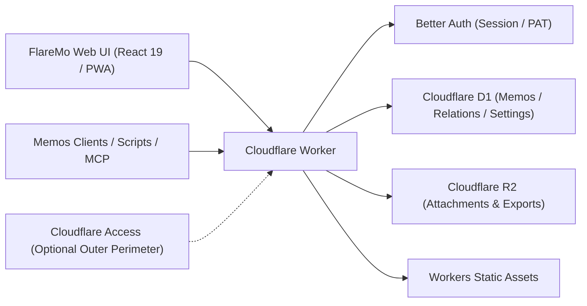

# FlareMo 🔥

<p align="center">
  <b>サーバー不要 · 運用コストゼロ · 24時間グローバル常時稼働 · データの完全な自己所有</b><br>
  個人では静かで集中できる思考記録スペース＆第2の脳として、チームではきめ細やかな権限を持つ共有ナレッジベースとして。
</p>

<p align="center">
  <a href="./README.md">English</a> •
  <a href="./README.zh-CN.md">简体中文</a> •
  <a href="./README.ja.md"><b>日本語</b></a> •
  <a href="./README.fr.md">Français</a> •
  <a href="./README.es.md">Español</a> •
  <a href="./README.ko.md">한국어</a> •
  <a href="./README.ru.md">Русский</a> •
  <a href="./README.ar.md">العربية</a>
</p>

<p align="center">
  <a href="https://github.com/realchendahuang/FlareMo/stargazers"></a>
  <a href="./LICENSE"></a>
  <a href="https://workers.cloudflare.com/"></a>
  <a href="https://github.com/usememos/memos"></a>
  <a href="https://www.better-auth.com/"></a>
  <a href="https://flaremo.app"></a>
</p>

<div align="center">

| ☀️ デスクトップ · ライトテーマ | 🌙 デスクトップ · ダークテーマ | 📱 モバイル · レスポンシブ |
| :---: | :---: | :---: |
|  |  |  |

<sub>実際の稼働画面：ライト・ダークテーマのシームレスな切り替えと、フル機能のモバイルレスポンシブ表示。表示されている機能はすべて、実際に動作するバックエンド機能に接続されています。</sub>

</div>

---

## 💡 FlareMoを選ぶ理由

FlomoやMemosといったツールは、摩擦の少ないメモ記録と邪魔の入らないタイムラインが持つ大きな価値を証明しました。しかし、従来型のノート環境をセルフホストするには、VPSを契約し、DockerとPostgreSQLを構成し、自動バックアップをスクリプトで組み、ディスクやハードウェアの故障に怯え続けることが普通でした。

FlareMoが立ち向かう問いはもっとシンプルです：**無料のCloudflareアカウント1つだけで、サーバー保守ゼロで、24時間365日オンラインで耐障害性が高く、世界中から高速にアクセスできるナレッジベースを持てるのか？**

- **真のサーバーレス**：コードも静的アセットも、ユーザーの近くにあるCloudflare Workersのエッジノード上でミリ秒応答。
- **最初からエンタープライズ級の耐久性**：ノートとメタデータはCloudflare D1が担当し、メディア添付ファイルはマルチリージョンレプリケーション付きのCloudflare R2に保存。
- **AIネイティブな第2の脳**：Agent MemoryハブにCLIとクロスエージェントSkillを同梱。AIエージェント（Claude、Cursor、Codex、ChatGPT、ZCode）が長期的な好みや記憶スコープを読み取り・更新できます。MCPエンドポイントも利用可能です。
- **一人には静かに、大勢には強力に**：デフォルトは暗号化された一人用のプライベートな空間。チームモードを有効にすると、ロールと3段階の公開範囲を備えた共同作業スペースに即座に変わります。
- **シンプル、でも粗削りではない**：インターフェースは静かに保たれ、すべての操作に存在する理由がある — 見せびらかす装飾はなく、役に立つものの欠落もありません。

---

## ✨ 主な機能

### 1. 瞬時のメモ作成とインスピレーションの振り返り
- **ミリ秒でキャプチャ**：カード型タイムライン、タグ、Markdown/GFM、画像・音声添付のプレビューに対応。
- **高速検索**：SQLite FTS5による全文インデックスとクエリ演算子（`has:attachment`、`is:pinned`、`before:YYYY-MM-DD`、`after:YYYY-MM-DD`、`in:timeline|archive|trash`）。
- **セマンティックな「探す」（ベクトル検索）**：Workers AIの埋め込みとVectorizeの派生ベクトルインデックスを組み合わせ、文脈に応じた呼び出しを実現。D1で権限を再検証し、必要時はFTS5へシームレスにフォールバック。
- **思考を呼び起こす**：内蔵の**デイリーレビュー**（この日の記録）、**ランダムウォーク**（タグやバックリンクのグラフをポストカード風の要約とともに散策）、関連ノートのおすすめ。
- **改訂履歴**：全バージョンの差分表示とワンクリックでの過去バージョン復元。

### 2. AI長期記憶（CLI + Skills）
- **Agent Memory**：`flaremo` CLIと`flaremo-memory` Skillを同梱。AIエージェントが共通のREST基盤を通じてセッションを跨いだ長期記憶（好み、プロジェクトの決定事項、制約、教訓）を記録・更新できます。
- **人間が最終確認**：`/memory` 画面でAIが記録した記憶を確認・検証・ロック・修正できます。
- **オープンなエコシステム**：推奨パスはCLI + Skills。既存のMCPクライアント向けに `/memory/mcp`（Streamable HTTP MCP）と `/mcp` エンドポイントも提供。

### 3. プロジェクトとタスク
- **プロジェクトで作業をまとめる**：ノートとTODOをプロジェクトに整理。ステータス列間をドラッグできるカンバンボード、優先度、手動並べ替え、期日に対応。
- **個人専用設計・取り消せる削除**：タスクは単一のオーナーに帰属。削除するとゴミ箱に移動し、復元するか自動消去されるまで保持されます。

### 4. タスク管理とリマインダー
- **タスクはプロジェクトに住む**：`/projects` ボード（ステータス列間のドラッグ）、優先度、手動並べ替え、期日により、プロジェクトページが作業スケジュールの一元的な住処になります。
- **時間の全体像をひと目で把握**：explorerホーム画面はミニ月カレンダーと期限超過・今日のリマインダーを並べて表示。期日がボードの裏に隠れることはありません。
- **期限超過リマインダー**：期限を過ぎたタスクはアプリ内通知で知らせ、任意でブラウザのWeb Pushにも対応。

### 5. チームコラボレーションと3段階の公開範囲
- **ロールガバナンス**：`owner`、`admin`、`member` の3ロール。管理者はワンタイムアクティベーションリンクでメンバーを招待します（パスワードはメンバー自身が設定し、管理者が平文の認証情報に触れることはありません）。
- **3段階の公開範囲**：
  - 🔒 **プライベート**：作成者本人のみ閲覧可能。
  - 👥 **チーム**：アクティブなチームメンバーに読み取り専用で共有。
  - 🌐 **公開**：期限付き共有リンク経由で匿名の読み取り専用アクセス。
- **安全なメンバー削除**：メンバーを削除すると、信頼性の高いバックグラウンドクリーンアップが走り、プライベートデータのみを消去してチームと公開のノートは保持します。
- **リーダーシート**：期限付きの読み取り専用シートを発行できます — ゲスト読者、講座の受講者、クライアントへの納品など。シートは有効期限が切れると自動的に失効します（認証解決時にフェイルクローズ、cron不要）。メンバー画面から管理するか、Personal Access Token で `PUT /api/app/admin/team/reader` を呼び出してメールアドレスから開通できます（`docs/team-mode.md` 参照）。

### 6. オフラインファースト＆PWA体験
- **インストール可能なPWA**：macOS、Windows、iOS、Androidのホーム画面に追加でき、ネイティブアプリのような操作感。
- **信頼性の高いオフライン同期**：下書きは即座にローカル保存。オフライン中の送信やアップロードはキューに積まれ、接続回復時に自動で再生されます。
- **ライブ音声キャプチャ**：`/capture` にアクセスすると、リアルタイムのストリーミング音声文字起こし（ASR）が利用できます。

### 7. Secure Better Authによるアプリケーションセキュリティ
- **Better Auth基盤**：ブラウザは `HttpOnly`・`SameSite=Lax` のクッキーセッション。スクリプト、CLI、MCP向けには失効可能な `memos_pat_` Personal Access Token を提供。
- **厳格なOrigin保護**：状態を変更するリクエストには厳密なOriginのホワイトリストを強制。Cloudflare Accessも任意の外層防御として併用できます。

### 8. Memos互換とシームレスな移行
- **Memos `/api/v1` 互換**：Memosの主要APIエンドポイント（デフォルトはcamelCase、ヘッダーでレガシーのsnake_case）とOpenAPIスキーマを提供。
- **サードパーティアプリ対応**：Moe Memosなどのモバイルクライアントから直接接続できます。
- **双方向のインポート＆エクスポート**：Memos / flomoからワンクリックでインポート（競合戦略付き）。生データ一式の完全エクスポートにも対応。

---

### 9. プラグインシステム：カードはプラグイン
- **5種の内蔵カード**：プレーン、デイリー、チケット、ポストカード、さらにcanvasで描く消印（ポストマーク）デモ。
- **ストアとキュレーション**：ディレクトリの閲覧、ワンクリックインストール（SHA-256検証済み）、有効化・無効化、並べ替え、デフォルト設定、非表示 — すべてアカウント設定から操作できます。公式ディレクトリは [flaremo.app/plugins](https://flaremo.app/plugins/registry.json)。
- **自作カードの導入**：管理者はローカルパッケージをインストール可能 — そのインスタンス上にのみ存在し、外部へ送信されることはありません。
- **制作ツール**：`pnpm plugin:new` で雛形生成、`pnpm plugin:check` は**インストール時にインスタンスが適用するのと同一のルール**で検証、`pnpm plugins:build` でパッケージ化。ドキュメントカードは純粋なJSONレイアウト、サンドボックスカードは自作のHTML/CSS/JSを動かせます。詳しくは[プラグインガイド](./docs/en/plugins.md)。
- **デフォルトで安全**：カードは不透明オリジンのサンドボックス上で動作し、**ネットワークアクセスは一切ありません**。コミュニティやブランドパックは管理者が有効化するまでオフのままです。

## 📊 Cloudflareの無料枠はどれだけ寛容か？

「無料」＝「大きく制限されている」と考えがちですが、テキスト中心の個人ナレッジベースにとって、Cloudflareの無料枠は事実上枯渇しないレベルです：

| リソース | 無料枠 | 想定容量 | 実用上の寿命 |
| :--- | :--- | :--- | :--- |
| **Cloudflare D1** | **5 GBデータベース** | 約 **250万件** のテキストメモ | 毎日100件書いても **68年** かかる容量 |
| **Cloudflare R2** | **10 GBストレージ** | 写真 約 **5,000〜10,000枚** / 音声 **80時間** | **Egress料金 $0**。公開共有でも帯域請求は発生しない |
| **Cloudflare Workers** | 寛容な無料リクエスト枠 | 世界300以上のエッジロケーション | コールドブートなしで世界中ミリ秒応答 |

---

## 🥊 比較：Cloudflareネイティブ vs 自宅NAS vs 従来型VPS

| 項目 | Cloudflareネイティブ (FlareMo) | 自宅NAS / ミニPC | 従来型VPS |
| :--- | :--- | :--- | :--- |
| **データの耐久性** | **エンタープライズ級マルチリージョンレプリケーション**、ハードウェア故障リスクゼロ | ドライブ故障や停電で全データ消失の恐れ | 手動のスナップショット・バックアップ運用に依存 |
| **保守** | **ゼロ**：OSパッチなし、Docker composeなし、DB保守なし | OSアップデート、Docker管理、SMART監視、ルーター設定 | カーネル更新、セキュリティパッチ、監視デーモン |
| **アクセス遅延** | **グローバルエッジCDN**、どこからでも100ms未満 | DDNS / frp / Tailscaleトンネルが必要で、自宅上り回線に律速 | 単一クラウドリージョンに依存、越境遅延が大きい |
| **SSLとドメイン** | **HTTPS自動化**とカスタムドメイン紐付け | 証明書の手動発行、リバースプロキシ設定 | Nginx / Caddy設定とLet's Encrypt更新の保守 |
| **費用** | 無料枠で **$0 / 月** | 高額な初期ハードウェア投資＋継続的な電気代 | サーバー・帯域の月額／年額料金が継続 |

---

## 🚀 5分でできるクイックデプロイ

### 方法1：Cloudflareへワンクリックデプロイ

[](https://deploy.workers.cloudflare.com/?url=https://github.com/realchendahuang/FlareMo)

リポジトリをGitHubアカウントにクローンし、D1・R2・Queues・Vectorizeを自動でプロビジョニングします。初回デプロイ後、`FLAREMO_PUBLIC_URL` とシークレットを設定してください（[docs/en/deploy.md](./docs/en/deploy.md#one-click-deploy-community-supported) 参照）。初回試行で「Github API Limit Exceeded」と表示された場合は、数分待ってから再試行してください。

### 方法2：GitHub Action（フォークでのセルフホスト）

フォーク上でActionsの **Deploy to Cloudflare** を実行すると、リソースのプロビジョニング、Workerの公開、認証シークレットの同期が行われます。pushでは公開されません。詳しくは [docs/en/github-action-deploy.md](./docs/en/github-action-deploy.md) を参照してください。

### 方法3：AIエージェントによるデプロイ（推奨）

ターミナルコマンドを実行できるエージェント（Claude Code、Cursor Agent、Codexなど）に、[docs/en/agent-deploy.md](./docs/en/agent-deploy.md) とともにリポジトリを渡してください：
> 「docs/en/agent-deploy.md に従って、FlareMo を私の Cloudflare アカウントにデプロイしてください。」

---

### 方法4：手動3ステップデプロイ

#### 1. Cloudflareリソースの作成
```bash
pnpm exec wrangler whoami
pnpm exec wrangler d1 create flaremo
pnpm exec wrangler r2 bucket create flaremo-attachments
```

または `pnpm provision:remote` を実行する方法もあります：不足しているD1 / R2 / Queue / Vectorizeリソースを作成し、D1の `database_id` を `wrangler.jsonc` に書き込みます。冪等に動作し、既存リソースはスキップされます。

#### 2. 設定とシークレットの構成
```bash
cp wrangler.jsonc.example wrangler.jsonc
```
生成された `database_id` を記入し、`FLAREMO_PUBLIC_URL` を本番ドメインに設定します。その後、シークレットを設定します：
```bash
pnpm exec wrangler secret put BETTER_AUTH_SECRET --config ./wrangler.jsonc
pnpm exec wrangler secret put FLAREMO_BOOTSTRAP_SECRET --config ./wrangler.jsonc
```

#### 3. デプロイ
```bash
pnpm deploy:dry-run
pnpm deploy
```

（フルの `pnpm verify` ゲートは、メンテナーが明示的に求めた場合のみ実行されます。）
本番ドメインの `/setup` にアクセスし、`FLAREMO_BOOTSTRAP_SECRET` を入力してOwnerアカウントを初期化します。

詳細ガイド：[デプロイガイド](./docs/en/deploy.md) · [GitHub Actionデプロイ](./docs/en/github-action-deploy.md) · [アップデートガイド](./docs/en/update.md)。

---

## 🧱 アーキテクチャと技術スタック



- **ランタイム**：Cloudflare Workers
- **フロントエンド**：React 19、Vite、TanStack Router、Tailwind CSS 4、Radix UI
- **データベース**：Cloudflare D1、Drizzle ORM
- **ストレージ**：Cloudflare R2
- **認証**：Better Auth（HttpOnlyクッキーセッション + 失効可能な `memos_pat_`）
- **AIと検索**：Workers AI、Vectorize、SQLite FTS5
- **プラグイン**：スロットベースの拡張プラットフォーム（[標準仕様](./docs/plugin-platform-standard.md)、[ガイド](./docs/en/plugins.md)）。パッケージはR2に置かれ、サンドボックス化されたカードはネットワークアクセスなしで動作します

---

## 🌟 Star History

[](https://star-history.com/#realchendahuang/FlareMo&Date)

---

## 📄 ライセンス

[GNU AGPL-3.0](./LICENSE) ライセンスでオープンソースとして公開されています。
Copyright (c) 2026 realchendahuang.
