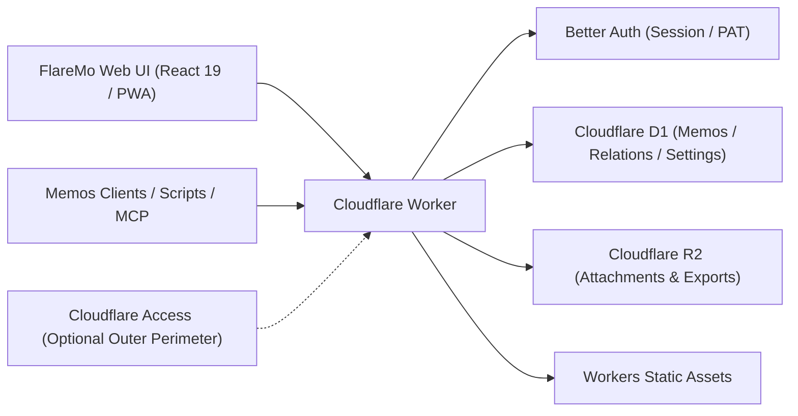

# FlareMo 🔥

<p align="center">
  <b>서버 제로 · 유지보수 비용 제로 · 24시간 글로벌 엣지 상시 가동 · 완전한 데이터 소유권</b><br>
  개인에게는 조용하고 집중할 수 있는 생각 기록 공간이자 제2의 뇌, 팀에게는 세밀한 권한 관리를 갖춘 공유 지식 베이스.
</p>

<p align="center">
  <a href="./README.md"><b>English</b></a> •
  <a href="./README.zh-CN.md">简体中文</a> •
  <a href="./README.ja.md">日本語</a> •
  <a href="./README.fr.md">Français</a> •
  <a href="./README.es.md">Español</a> •
  <a href="./README.ko.md">한국어</a> •
  <a href="./README.ru.md">Русский</a> •
  <a href="./README.ar.md">العربية</a>
</p>

<p align="center">
  <a href="https://github.com/realchendahuang/FlareMo/stargazers"></a>
  <a href="./LICENSE"></a>
  <a href="https://workers.cloudflare.com/"></a>
  <a href="https://github.com/usememos/memos"></a>
  <a href="https://www.better-auth.com/"></a>
  <a href="https://flaremo.app"></a>
</p>

<div align="center">

| ☀️ 데스크톱 · 라이트 모드 | 🌙 데스크톱 · 다크 모드 | 📱 모바일 · 반응형 |
| :---: | :---: | :---: |
|  |  |  |

<sub>실제 운영 화면 스크린샷: 라이트/다크 모드 매끄러운 전환과 모바일 완전 반응형. 화면에 보이는 모든 기능은 실제로 동작하는 백엔드 기능과 연결되어 있습니다.</sub>

</div>

---

## 💡 왜 FlareMo인가?

Flomo와 Memos 같은 도구들은 부담 없는 메모 기록과 방해받지 않는 타임라인이 지닌 큰 가치를 증명해 왔습니다. 하지만 전통적인 노트 환경을 자체 호스팅하려면 VPS 비용을 지불하고, Docker와 PostgreSQL을 설정하고, 자동 백업 스크립트를 작성·관리하면서 디스크나 하드웨어 고장을 걱정해야 했습니다.

FlareMo는 더 단순한 질문에 답합니다: **무료 Cloudflare 계정 하나만으로, 서버 유지보수 없이 24시간 온라인으로 살아있고 전 세계에서 가속되는 지식 베이스를 만들 수 없을까?**

- **진정한 서버리스**: 코드와 정적 자산 모두 사용자 바로 근처의 Cloudflare Workers 엣지 노드에서 밀리초 단위 지연으로 실행됩니다.
- **기본 갖춰진 엔터프라이즈급 내구성**: Cloudflare D1이 메모와 메타데이터를 담당하고, Cloudflare R2가 멀티 리전 복제로 미디어 첨부파일을 저장합니다.
- **AI 네이티브 제2의 뇌**: Agent Memory 허브에 CLI와 크로스 에이전트 스킬이 내장되어, AI 에이전트(Claude, Cursor, Codex, ChatGPT, ZCode)가 장기 선호도와 기억 범위를 읽고 갱신할 수 있습니다. MCP 엔드포인트도 함께 제공됩니다.
- **혼자서는 조용히, 함께라면 강력하게**: 기본값은 암호화된 비공개 1인용 안식처입니다. 팀 모드를 켜면 역할과 3단계 공개 범위를 갖춘 협업 공간으로 즉시 바뀝니다.
- **심플하되 단순하지 않게**: 인터페이스는 조용하고 모든 컨트롤은 존재 이유가 분명합니다 — 주의를 끄는 장식도, 빠진 기능도 없습니다.

---

## ✨ 핵심 기능

### 1. 즉석 기록 & 영감을 주는 회고
- **밀리초 만에 기록**: 카드형 타임라인, 태그, Markdown/GFM, 이미지·오디오 첨부 미리보기.
- **번개같은 검색**: SQLite FTS5 전문 인덱싱과 쿼리 연산자 지원 (`has:attachment`, `is:pinned`, `before:YYYY-MM-DD`, `after:YYYY-MM-DD`, `in:timeline|archive|trash`).
- **의미 기반 '찾기' (벡터 검색)**: Workers AI 임베딩과 Vectorize 파생 벡터 인덱스를 결합해 문맥에 맞는 회상을 제공하며, D1 권한을 재검증하고 필요 시 FTS5로 매끄럽게 대체합니다.
- **생각 활성화**: 내장 **데일리 리뷰**(과거의 오늘), **랜덤 워크**(태그·백링크 그래프를 탐험하며 엽서 요약 수집), 관련 노트 추천.
- **버전 이력**: 전체 버전 diff 비교와 클릭 한 번으로 과거 버전 복원.

### 2. AI 장기 기억 (CLI + Skills)
- **Agent Memory**: `flaremo` CLI와 `flaremo-memory` 스킬을 동봉 — AI 에이전트가 공용 REST 기반을 통해 세션을 넘어 이어지는 장기 기억(선호도, 프로젝트 결정, 제약 조건, 교훈)을 기록·갱신합니다.
- **Human in the loop**: `/memory` 화면에서 AI가 기록한 기억을 검토하고, 확인·잠금·수정할 수 있습니다.
- **열린 생태계**: 권장 경로는 CLI + Skills이며, 기존 MCP 클라이언트를 위해 `/memory/mcp`(Streamable HTTP MCP)와 `/mcp` 엔드포인트도 제공합니다.

### 3. 프로젝트 & 작업
- **프로젝트로 작업 모으기**: 관련 메모와 할 일을 프로젝트로 묶어 관리합니다. 상태 열을 드래그로 옮기는 칸반 보드, 우선순위, 수동 정렬, 마감일을 지원합니다.
- **개인 전용, 되돌릴 수 있는 삭제**: 작업은 소유자 한 사람의 소유이며, 삭제 시 휴지통으로 이동해 복원하거나 기간이 지나면 자동으로 영구 삭제됩니다.

### 4. 작업 관리 & 알림
- **작업은 프로젝트 안에**: `/projects` 보드(상태 열 간 드래그), 우선순위, 수동 정렬, 마감일 덕분에 프로젝트 페이지가 일정 관리의 단일한 홈이 됩니다.
- **일정이 한눈에**: 탐색기 홈 화면이 미니 월간 캘린더와 기한 초과/오늘 알림을 함께 보여줘, 마감이 보드 뒤에 숨지 않습니다.
- **기한 초과 알림**: 기한이 지난 작업은 앱 내 알림을 띄우고, 브라우저 웹 푸시도 선택적으로 켤 수 있습니다.

### 5. 팀 협업 & 3단계 공개 범위
- **역할 거버넌스**: `owner`, `admin`, `member` 역할. 관리자는 1회용 활성화 링크로 멤버를 초대하고, 멤버가 직접 비밀번호를 설정합니다(관리자는 평문 자격 증명을 절대 다루지 않습니다).
- **3단계 공개 범위**:
  - 🔒 **비공개**: 작성자 본인만 열람 가능.
  - 👥 **팀 공개**: 활성 팀원에게 읽기 전용 공유.
  - 🌐 **전체 공개**: 기한이 있는 공유 링크로 익명 읽기 전용 접근.
- **안전한 멤버 제외**: 멤버 제거 시 신뢰할 수 있는 백그라운드 정리가 실행되어 비공개 데이터는 완전히 삭제하고 팀 및 공개 메모는 보존합니다.
- **리더 시트**: 기한이 있는 읽기 전용 시트를 부여할 수 있습니다 — 게스트 독자, 강의 수강생, 고객 납품 등. 시트는 만료 시점에 자동으로 접근이 차단됩니다(자격 해석 시 fail-closed, 크론 불필요). 멤버 페이지에서 관리하거나, Personal Access Token으로 `PUT /api/app/admin/team/reader` 엔드포인트를 호출해 이메일로 개통할 수 있습니다(`docs/team-mode.md` 참조).

### 6. 오프라인 우선 & PWA 경험
- **설치형 PWA**: macOS, Windows, iOS, Android 홈 화면에 설치해 네이티브 앱과 같은 사용감을 제공합니다.
- **신뢰할 수 있는 오프라인 동기화**: 초안은 즉시 로컬에 저장됩니다. 오프라인 상태의 제출과 업로드는 큐에 쌓였다가 연결이 복구되면 자동으로 재생됩니다.
- **실시간 음성 기록**: `/capture` 페이지에서 실시간 스트리밍 음성 인식(ASR) 전사를 지원합니다.

### 7. 강력한 Better Auth 애플리케이션 보안
- **Better Auth 기반**: `HttpOnly`, `SameSite=Lax` 브라우저 쿠키 세션과, 스크립트·CLI·MCP용으로 폐기 가능한 `memos_pat_` Personal Access Token을 제공합니다.
- **엄격한 Origin 보호**: 상태 변경 요청에는 정확한 Origin 화이트리스트 검증을 강제합니다. Cloudflare Access는 선택적 외부 방어선으로 계속 사용할 수 있습니다.

### 8. Memos 호환 & 매끄러운 이전
- **Memos `/api/v1` 호환**: 핵심 Memos API 엔드포인트(기본 camelCase, 헤더로 legacy snake_case)와 OpenAPI 스키마를 제공합니다.
- **서드파티 앱 대응**: Moe Memos 같은 모바일 클라이언트에서 바로 연결할 수 있습니다.
- **양방향 가져오기/내보내기**: Memos / flomo에서 충돌 처리 전략과 함께 원클릭 가져오기, 전체 원본 내보내기 번들을 지원합니다.

---

### 9. 플러그인 시스템: 카드도 플러그인
- **기본 카드 5장**: Plain, Daily, Ticket, Postcard, 그리고 canvas로 그리는 Postmark 데모.
- **스토어와 큐레이션**: 설정에서 디렉터리 탐색, 원클릭 설치(SHA-256 검증), 활성화/비활성화, 순서 변경, 기본 카드 지정, 숨기기를 모두 처리합니다. 공식 디렉터리는 [flaremo.app/plugins](https://flaremo.app/plugins/registry.json)에 있습니다.
- **직접 업로드**: 관리자는 로컬 패키지를 설치할 수 있습니다 — 해당 인스턴스에만 존재하며 어디로도 전송되지 않습니다.
- **제작 도구**: `pnpm plugin:new`로 스캐폴딩하고, `pnpm plugin:check`는 **인스턴스가 설치 시 강제하는 것과 정확히 동일한 규칙**으로 검증하며, `pnpm plugins:build`로 패키징합니다. document 카드는 순수 JSON 레이아웃, sandbox 카드는 직접 작성한 HTML/CSS/JS를 실행합니다. 자세한 내용은 [플러그인 가이드](./docs/en/plugins.md)를 참조하세요.
- **기본이 안전**: 카드는 불투명 오리진 샌드박스에서 **네트워크 접근 없이** 실행됩니다. 커뮤니티/브랜드 팩은 관리자가 켜기 전까지 꺼져 있습니다.

## 📊 Cloudflare 무료 제공량은 얼마나 넉넉한가?

'무료'는 곧 '극심한 제한'이라고 여기는 경우가 많습니다. 하지만 텍스트 중심의 개인 지식 베이스에는 Cloudflare의 무료 할당량이 사실상 무한대입니다:

| 리소스 | 무료 제공량 | 환산 용량 | 실제 사용 가능 기간 |
| :--- | :--- | :--- | :--- |
| **Cloudflare D1** | **5 GB 데이터베이스** | 텍스트 메모 약 **250만 개** | 매일 100개씩 작성해도 채우는 데 **68년** 소요 |
| **Cloudflare R2** | **10 GB 스토리지** | 사진 약 **5,000–10,000장** / 음성 **80시간** | **아웃바운드 요금 $0**; 공개 공유로도 대역폭 청구가 발생하지 않음 |
| **Cloudflare Workers** | 넉넉한 무료 요청 한도 | 전 세계 300개 이상 엣지 로케이션 | 콜드 부트 없는 전 세계 밀리초 응답 |

---

## 🥊 비교: Cloudflare 네이티브 vs 홈 NAS vs 전통적 VPS

| 기준 | Cloudflare 네이티브 (FlareMo) | 홈 NAS / 미니 PC | 전통적 VPS |
| :--- | :--- | :--- | :--- |
| **데이터 내구성** | **엔터프라이즈급 멀티 리전 복제**, 하드웨어 고장 위험 제로 | 단일 디스크 고장이나 정전 한 번으로 데이터 전체 손실 가능 | 수동 스냅샷·백업 루틴에 의존 |
| **유지보수** | **제로**: OS 패치도, Docker compose도, DB 관리도 없음 | OS 업데이트, Docker 관리, SMART 디스크 알림, 라우터 설정 | 커널 업그레이드, 보안 패치, 감시 데몬 관리 |
| **접속 지연** | **글로벌 엣지 CDN**, 어디서나 100ms 미만 응답 | DDNS / frp / Tailscale 터널 필요, 가정용 회선 업링크에 제약 | 단일 클라우드 리전에 의존, 국경 간 지연 큼 |
| **SSL & 도메인** | **자동 HTTPS** 및 커스텀 도메인 바인딩 | 수동 인증서 발급, 리버스 프록시 설정 | Nginx / Caddy 설정과 Let's Encrypt 갱신 관리 |
| **비용** | 무료 티어에서 **월 $0** | 높은 초기 하드웨어 비용 + 지속적인 전기료 | 매월/매년 청구되는 서버·대역폭 비용 |

---

## 🚀 5분 만에 배포하기

### 방법 1: 원클릭 Cloudflare 배포

[](https://deploy.workers.cloudflare.com/?url=https://github.com/realchendahuang/FlareMo)

저장소를 내 GitHub 계정으로 복제하고 D1, R2, Queues, Vectorize를 자동으로 프로비저닝합니다. 최초 배포 후 `FLAREMO_PUBLIC_URL`과 시크릿을 설정하세요([docs/en/deploy.md](./docs/en/deploy.md#one-click-deploy-community-supported) 참조). 첫 시도에서 "Github API Limit Exceeded"가 표시되면 몇 분 기다렸다가 다시 시도하세요.

### 방법 2: GitHub Action (셀프 호스팅 포크)

포크에서 Actions의 **Deploy to Cloudflare**를 실행하면 리소스 프로비저닝, Worker 배포, 인증 시크릿 동기화가 한 번에 이루어집니다. push만으로는 배포되지 않습니다. [docs/en/github-action-deploy.md](./docs/en/github-action-deploy.md)를 참조하세요.

### 방법 3: AI 에이전트로 배포 (권장)

터미널 명령을 실행할 수 있는 AI 에이전트(Claude Code, Cursor Agent, Codex 등)에게 저장소와 함께 [docs/en/agent-deploy.md](./docs/en/agent-deploy.md)를 전달하세요:
> "docs/en/agent-deploy.md 문서에 따라 내 Cloudflare 계정에 FlareMo를 배포해 줘."

---

### 방법 4: 3단계 수동 배포

#### 1. Cloudflare 리소스 생성
```bash
pnpm exec wrangler whoami
pnpm exec wrangler d1 create flaremo
pnpm exec wrangler r2 bucket create flaremo-attachments
```

또는 `pnpm provision:remote`를 대신 실행하세요: 누락된 D1 / R2 / Queue / Vectorize 리소스를 생성하고 D1 `database_id`를 `wrangler.jsonc`에 대신 기록합니다. 멱등하게 동작하며 기존 리소스는 건너뜁니다.

#### 2. 설정 및 시크릿 구성
```bash
cp wrangler.jsonc.example wrangler.jsonc
```
생성된 `database_id`를 채우고 `FLAREMO_PUBLIC_URL`을 프로덕션 도메인으로 설정하세요. 그다음 시크릿을 설정합니다:
```bash
pnpm exec wrangler secret put BETTER_AUTH_SECRET --config ./wrangler.jsonc
pnpm exec wrangler secret put FLAREMO_BOOTSTRAP_SECRET --config ./wrangler.jsonc
```

#### 3. 배포
```bash
pnpm deploy:dry-run
pnpm deploy
```

(전체 `pnpm verify` 게이트는 유지관리자가 명시적으로 요청할 때만 실행됩니다.)
프로덕션 도메인의 `/setup`에 접속해 `FLAREMO_BOOTSTRAP_SECRET`을 입력하고 Owner 계정을 초기화하세요.

상세 가이드: [배포 가이드](./docs/en/deploy.md) · [GitHub Action 배포](./docs/en/github-action-deploy.md) · [업데이트 가이드](./docs/en/update.md).

---

## 🧱 아키텍처 & 기술 스택



- **런타임**: Cloudflare Workers
- **프론트엔드**: React 19, Vite, TanStack Router, Tailwind CSS 4, Radix UI
- **데이터베이스**: Cloudflare D1, Drizzle ORM
- **스토리지**: Cloudflare R2
- **인증**: Better Auth (HttpOnly 쿠키 세션 + 폐기 가능한 `memos_pat_`)
- **AI & 검색**: Workers AI, Vectorize, SQLite FTS5
- **플러그인**: 슬롯 기반 확장 플랫폼([표준](./docs/plugin-platform-standard.md), [가이드](./docs/en/plugins.md)); 패키지는 R2에 저장되며 샌드박스 카드는 네트워크 접근 없이 실행됩니다

---

## 🌟 Star History

[](https://star-history.com/#realchendahuang/FlareMo&Date)

---

## 📄 라이선스

[GNU AGPL-3.0](./LICENSE) 라이선스에 따라 오픈소스로 공개됩니다.
Copyright (c) 2026 realchendahuang.
