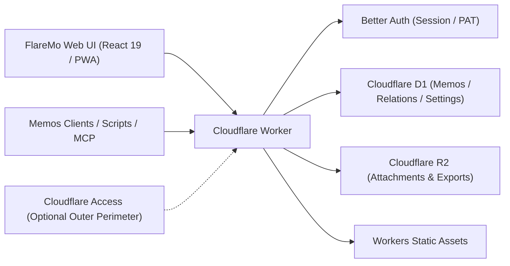

# FlareMo 🔥

<p align="center">
  <b>Ноль серверов · Ноль затрат на обслуживание · Глобальная доступность 24/7 · Полный контроль над данными</b><br>
  Для личного использования — тихое пространство заметок и второй мозг с ИИ; для команд — общая база знаний с гибким разграничением прав.
</p>

<p align="center">
  <a href="./README.md">English</a> •
  <a href="./README.zh-CN.md">简体中文</a> •
  <a href="./README.ja.md">日本語</a> •
  <a href="./README.fr.md">Français</a> •
  <a href="./README.es.md">Español</a> •
  <a href="./README.ko.md">한국어</a> •
  <a href="./README.ru.md"><b>Русский</b></a> •
  <a href="./README.ar.md">العربية</a>
</p>

<p align="center">
  <a href="https://github.com/realchendahuang/FlareMo/stargazers"></a>
  <a href="./LICENSE"></a>
  <a href="https://workers.cloudflare.com/"></a>
  <a href="https://github.com/usememos/memos"></a>
  <a href="https://www.better-auth.com/"></a>
  <a href="https://flaremo.app"></a>
</p>

<div align="center">

| ☀️ Десктоп · Светлая тема | 🌙 Десктоп · Тёмная тема | 📱 Мобильный интерфейс |
| :---: | :---: | :---: |
|  |  |  |

<sub>Реальные снимки работающего приложения: плавное переключение тем и полная мобильная адаптивность. Все отображаемые функции полностью подключены к бэкенду.</sub>

</div>

---

## 💡 Почему FlareMo?

Сервисы вроде Flomo и Memos доказали ценность быстрой фиксации мыслей и ленты заметок без отвлекающих факторов. Однако самостоятельный хостинг таких решений обычно требует аренды VPS, настройки Docker и PostgreSQL, написания скриптов бэкапа и постоянного страха перед поломкой жесткого диска.

FlareMo отвечает на более простой вопрос: **Можно ли получить отказоустойчивую, глобально ускоренную базу знаний, доступную 24/7 без обслуживания серверов, используя лишь бесплатный аккаунт Cloudflare?**

- **Истинный Serverless**: И код, и статические ресурсы исполняются на пограничных узлах Cloudflare Workers рядом с вами, с откликом в считанные миллисекунды.
- **Корпоративная надежность из коробки**: Cloudflare D1 хранит заметки и метаданные, а Cloudflare R2 с мультирегиональной репликацией надежно держит медиавложения.
- **AI-Native второй мозг**: Встроенные эндпоинты MCP и хаб «Agent Memory» позволяют ИИ-агентам (Claude, Cursor, Codex, ChatGPT) читать и обновлять ваши долгосрочные предпочтения и области памяти.
- **Тихо для одного, мощно для многих**: По умолчанию это зашифрованное приватное пространство для одного пользователя. Включите командный режим — и оно мгновенно превращается в совместное рабочее пространство с ролями и тремя уровнями видимости.
- **Минимализм, не примитивизм**: Интерфейс остается тихим, и каждый элемент управления заслуживает своего места — ничего кричащего и лишнего, ничего полезного и недостающего.

---

## ✨ Ключевые возможности

### 1. Мгновенная фиксация и вдохновляющие обзоры
- **Запись за миллисекунды**: Хронологическая лента в виде карточек, теги, Markdown/GFM, предпросмотр изображений и аудиовложений.
- **Молниеносный поиск**: Полнотекстовая индексация SQLite FTS5 с операторами запросов (`has:attachment`, `is:pinned`, `before:YYYY-MM-DD`, `after:YYYY-MM-DD`, `in:timeline|archive|trash`).
- **Семантический «Поиск» (векторный)**: Эмбеддинги Workers AI в паре с производными векторными индексами Vectorize для поиска по смыслу; права повторно проверяются по D1, а при необходимости поиск бесшовно откатывается к FTS5.
- **Активация мыслей**: Встроенные **Ежедневный обзор** («В этот день»), **Случайная прогулка** (странствие по графу тегов и обратных ссылок со сводками-открытками) и рекомендации похожих заметок.
- **История версий**: Наглядное сравнение изменений и восстановление любой ревизии в один клик.

### 2. Долгосрочная память ИИ и нативный MCP
- **Agent Memory**: Через эндпоинт `/memory/mcp` ИИ-агенты могут записывать и обновлять долговременную память между сессиями (предпочтения, проектные решения, ограничения, уроки).
- **Контроль человеком**: На странице `/memory` вы можете просматривать, подтверждать, закреплять или исправлять записанные ИИ воспоминания.
- **Открытая экосистема**: Стандартный эндпоинт `/mcp` (Streamable HTTP MCP) для программного чтения и добавления заметок.

### 3. Проекты и задачи
- **Группируйте работу по проектам**: Заметки и дела собираются в проекты: канбан-доска (перетаскивание между колонками статусов), приоритеты, ручной порядок сортировки и сроки.
- **Лично по умолчанию, удаление обратимо**: Задачи принадлежат одному владельцу; удаление мягкое — записи попадают в корзину до восстановления или автоматической очистки.

### 4. Управление задачами и напоминания
- **Задачи живут в проектах**: Доска `/projects` (перетаскивание между колонками статусов), приоритеты, ручной порядок сортировки и сроки делают страницы проектов единым домом для планирования работы.
- **Горизонты времени одним взглядом**: Главный экран обозревателя сочетает мини-календарь на месяц с напоминаниями о просроченных и сегодняшних задачах — сроки больше не прячутся за доской.
- **Напоминания о просрочке**: Просроченные задачи порождают уведомления в приложении, с опциональными браузерными Web Push-уведомлениями.

### 5. Командная работа и 3 уровня видимости
- **Ролевое управление**: Роли `owner`, `admin` и `member`. Администраторы приглашают участников через одноразовые ссылки активации (участники сами задают пароли; администраторы никогда не видят учетные данные в открытом виде).
- **3 уровня видимости**:
  - 🔒 **Приватно**: Видно только автору.
  - 👥 **Команда**: Общий доступ только для чтения активным участникам команды.
  - 🌐 **Публично**: Анонимный доступ только для чтения по временным ссылкам.
- **Безопасное удаление участника**: При удалении пользователя запускается надежная фоновая очистка: личные данные физически удаляются, а командные и публичные заметки сохраняются.
- **Места читателей**: Выдайте место с ограниченным сроком и доступом только для чтения — гостевые читатели, слушатели курсов, сдача проекта клиентам. По истечении срока доступ закрывается автоматически (fail-closed при разборе учетных данных, без cron). Управляйте местами на странице участников или выдавайте их по email через `PUT /api/app/admin/team/reader` с персональным токеном доступа (см. `docs/team-mode.md`).

### 6. Офлайн-первым и возможности PWA
- **Устанавливаемое PWA**: Установка на macOS, Windows, iOS или Android с ощущением нативного приложения.
- **Надежная офлайн-синхронизация**: Черновики мгновенно сохраняются локально. Созданные офлайн заметки и загрузки встают в очередь и автоматически повторяются при восстановлении связи.
- **Живой голосовой ввод**: Страница `/capture` с потоковым распознаванием речи в текст (ASR) в реальном времени.

### 7. Безопасность приложения на базе Better Auth
- **На движке Better Auth**: Cookie-сессии браузера с `HttpOnly` и `SameSite=Lax`; отзываемые персональные токены доступа `memos_pat_` для скриптов, CLI и MCP.
- **Строгая защита Origin**: Все изменяющие состояние запросы требуют точного совпадения с белым списком origin. Cloudflare Access остается доступным как опциональный внешний периметр обороны.

### 8. Совместимость с Memos и бесшовная миграция
- **Совместимость с Memos `/api/v1`**: Поддержка ключевых эндпоинтов Memos API (по умолчанию camelCase, legacy snake_case через заголовок) и OpenAPI-схемы.
- **Готовность к сторонним приложениям**: Прямая работа с мобильными клиентами вроде Moe Memos.
- **Двусторонний импорт и экспорт**: Импорт из Memos / flomo в один клик со стратегиями разрешения конфликтов и полными экспортными пакетами исходных данных.

---

### 9. Система плагинов: карточки как плагины
- **Пять встроенных карточек**: Простая, Дневная, Билет, Открытка и демонстрационный Штемпель, нарисованный на canvas.
- **Магазин и курирование**: просмотр каталогов, установка в один клик (с проверкой SHA-256), включение/выключение, изменение порядка, карточка по умолчанию, скрытие — всё в настройках аккаунта. Официальный каталог: [flaremo.app/plugins](https://flaremo.app/plugins/registry.json).
- **Свои пакеты**: администратор может установить локальный пакет — он существует только в этом инстансе и никуда не отправляется.
- **Инструменты автора**: `pnpm plugin:new` создает каркас, `pnpm plugin:check` проверяет по **тем же правилам, которые инстансы применяют при установке**, `pnpm plugins:build` собирает пакет. Document-карточки — чистый JSON-макет; sandbox-карточки исполняют ваш собственный HTML/CSS/JS. Подробнее: [руководство по плагинам](./docs/en/plugins.md).
- **Безопасно по умолчанию**: карточки работают в песочнице с непрозрачным origin и **без доступа к сети**; пакеты сообщества и брендов выключены, пока администратор их не включит.

## 📊 Насколько щедр бесплатный тариф Cloudflare?

Многие считают, что «бесплатно» означает «урезано до предела». Для текстовых персональных баз знаний бесплатные квоты Cloudflare практически неисчерпаемы:

| Ресурс | Бесплатная квота | Эквивалентный объем | Срок реального использования |
| :--- | :--- | :--- | :--- |
| **Cloudflare D1** | **База данных 5 ГБ** | Около **2,5 млн** текстовых заметок | При 100 заметках в день заполнится лишь через **68 лет** |
| **Cloudflare R2** | **Хранилище 10 ГБ** | Около **5 000–10 000 фото** / **80 ч** голосовых записей | **$0 за исходящий трафик**; публичный шеринг не приведет к счетам за трафик |
| **Cloudflare Workers** | Щедрые лимиты бесплатных запросов | 300+ пограничных точек по всему миру | Миллисекундный отклик в любой точке мира без холодных стартов |

---

## 🥊 Сравнение: Cloudflare Native против домашнего NAS и классического VPS

| Критерий | Cloudflare Native (FlareMo) | Домашний NAS / мини-ПК | Классический VPS |
| :--- | :--- | :--- | :--- |
| **Сохранность данных** | **Корпоративная мультирегиональная репликация**, нулевой риск потери из-за железа | Отказ одного диска или отключение питания могут уничтожить все данные | Зависит от ручных снапшотов и процедур бэкапа |
| **Обслуживание** | **Нулевое**: без патчей ОС, без Docker compose, без обслуживания БД | Обновления ОС, уход за Docker, SMART-алерты дисков, настройка роутера | Обновления ядра, патчи безопасности, watchdog-демоны |
| **Задержка доступа** | **Глобальный пограничный CDN**, отклик меньше 100 мс откуда угодно | Нужны DDNS / frp / туннели Tailscale, ограничено домашним аплинком | Привязка к одному региону облака; высокая межграничная задержка |
| **SSL и домены** | **Автоматический HTTPS** и привязка собственных доменов | Ручная выдача сертификатов, настройка обратного прокси | Настройка Nginx / Caddy и продление Let's Encrypt |
| **Финансовые затраты** | **$0 / месяц** на бесплатном тарифе | Высокие разовые затраты на железо + электричество | Постоянные ежемесячные или годовые счета за сервер и трафик |

---

## 🚀 Быстрое развертывание за 5 минут

### Способ 1: Развертывание в один клик

[](https://deploy.workers.cloudflare.com/?url=https://github.com/realchendahuang/FlareMo)

Клонирует репозиторий в ваш аккаунт GitHub и автоматически создает D1, R2, Queues и Vectorize. После первоначального развертывания задайте `FLAREMO_PUBLIC_URL` и секреты (см. [docs/en/deploy.md](./docs/en/deploy.md#one-click-deploy-community-supported)). Если первая попытка сообщает «Github API Limit Exceeded», подождите несколько минут и повторите.

### Способ 2: GitHub Action (собственный форк)

В своем форке запустите **Deploy to Cloudflare** во вкладке Actions, чтобы создать ресурсы, опубликовать Worker и синхронизировать секреты аутентификации. Обычные push ничего не публикуют. См. [docs/en/github-action-deploy.md](./docs/en/github-action-deploy.md).

### Способ 3: Развертывание с ИИ-агентом (Рекомендуется)

Передайте репозиторий агенту, умеющему выполнять команды в терминале (например, Claude Code, Cursor Agent, Codex), вместе с [docs/en/agent-deploy.md](./docs/en/agent-deploy.md):
> «Пожалуйста, разверните FlareMo в моем аккаунте Cloudflare согласно docs/en/agent-deploy.md».

---

### Способ 4: Ручное развертывание в 3 шага

#### 1. Создание ресурсов Cloudflare
```bash
pnpm exec wrangler whoami
pnpm exec wrangler d1 create flaremo
pnpm exec wrangler r2 bucket create flaremo-attachments
```

Или запустите вместо этого `pnpm provision:remote`: он создаст недостающие ресурсы D1 / R2 / Queue / Vectorize и сам впишет `database_id` D1 в `wrangler.jsonc`. Операция идемпотентна — существующие ресурсы пропускаются.

#### 2. Настройка конфигурации и секретов
```bash
cp wrangler.jsonc.example wrangler.jsonc
```
Укажите сгенерированный `database_id` и задайте `FLAREMO_PUBLIC_URL` равным вашему продакшен-домену. Затем установите секреты:
```bash
pnpm exec wrangler secret put BETTER_AUTH_SECRET --config ./wrangler.jsonc
pnpm exec wrangler secret put FLAREMO_BOOTSTRAP_SECRET --config ./wrangler.jsonc
```

#### 3. Публикация
```bash
pnpm deploy:dry-run
pnpm deploy
```

(Полный гейт `pnpm verify` выполняется только по явному запросу мейнтейнера.)
Откройте `/setup` на вашем продакшен-домене и введите `FLAREMO_BOOTSTRAP_SECRET`, чтобы инициализировать учетную запись владельца.

Подробные руководства: [Руководство по развертыванию](./docs/en/deploy.md) · [Развертывание через GitHub Action](./docs/en/github-action-deploy.md) · [Руководство по обновлению](./docs/en/update.md).

---

## 🧱 Архитектура и технологический стек



- **Рантайм**: Cloudflare Workers
- **Фронтенд**: React 19, Vite, TanStack Router, Tailwind CSS 4, Radix UI
- **База данных**: Cloudflare D1, Drizzle ORM
- **Хранилище**: Cloudflare R2
- **Аутентификация**: Better Auth (cookie-сессия HttpOnly + отзываемый `memos_pat_`)
- **ИИ и поиск**: Workers AI, Vectorize, SQLite FTS5
- **Плагины**: расширяемая платформа на основе слотов ([стандарт](./docs/plugin-platform-standard.md), [руководство](./docs/en/plugins.md)); пакеты хранятся в R2, карточки в песочнице работают без доступа к сети

---

## 🌟 Star History

[](https://star-history.com/#realchendahuang/FlareMo&Date)

---

## 📄 Лицензия

Проект распространяется по лицензии [GNU AGPL-3.0](./LICENSE).
Copyright (c) 2026 realchendahuang.
