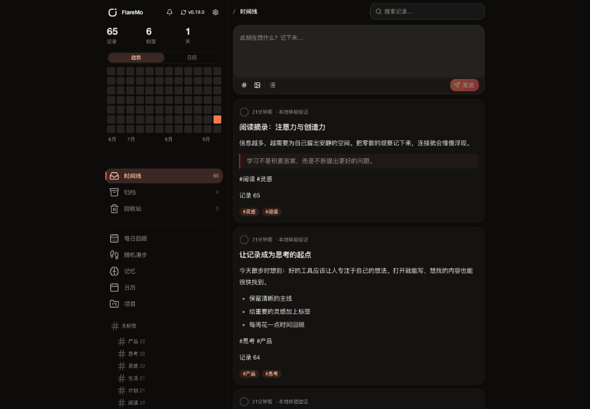
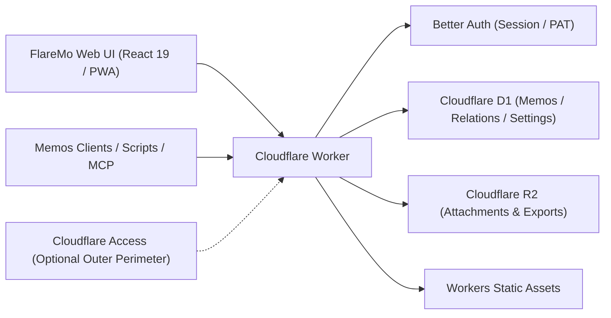

# FlareMo 🔥

<p align="center">
  <b>0 服务器 · 0 维护成本 · 24 小时全球边缘在线 · 数据绝对自主掌控</b><br>
  一个人用，是安静专注的私人灵感速记与第二大脑；一个团队用，是具备多级权限的共享知识库。
</p>

<p align="center">
  <a href="./README.md">English</a> •
  <a href="./README.zh-CN.md"><b>简体中文</b></a> •
  <a href="./README.ja.md">日本語</a> •
  <a href="./README.fr.md">Français</a> •
  <a href="./README.es.md">Español</a> •
  <a href="./README.ko.md">한국어</a> •
  <a href="./README.ru.md">Русский</a> •
  <a href="./README.ar.md">العربية</a>
</p>

<p align="center">
  <a href="https://github.com/realchendahuang/FlareMo/stargazers"></a>
  <a href="./LICENSE"></a>
  <a href="https://workers.cloudflare.com/"></a>
  <a href="https://github.com/usememos/memos"></a>
  <a href="https://www.better-auth.com/"></a>
  <a href="https://flaremo.app"></a>
</p>

<div align="center">

| ☀️ 桌面端 · 浅色明亮 | 🌙 桌面端 · 深色沉浸 | 📱 移动端 · 极简随行 |
| :---: | :---: | :---: |
|  |  |  |

<sub>真实运行界面：支持深浅主题无缝切换与全功能移动端自适应。所有展示功能均已稳定接入后端，不放未实现的占位按钮。</sub>

</div>

---

## 💡 为什么选择 FlareMo

Flomo 和 Memos 证明了「快速捕捉 + 流式时间线」这种无压力记录体验的巨大价值。但自部署传统的笔记系统通常意味着：你需要一台按月付费的 VPS、安装并配置 Docker / Postgres、编写定时备份脚本，还要时刻提防硬盘损坏或硬件故障导致的数据损失。

FlareMo 回答了一个更简单的问题：**仅凭一个免费的 Cloudflare 账号、零服务器维护，你能拥有一个 7×24 小时在线、有韧性、全球加速的知识库吗？**

- **真正的 Serverless**：代码与静态前端直接部署在离你最近的 Cloudflare Workers 边缘节点，毫秒级响应。
- **开箱即用的企业级持久化**：Cloudflare D1 承载笔记与元数据，Cloudflare R2 存储媒体附件，自带多地域副本。
- **AI 原生第二大脑**：Agent Memory 记忆中枢自带 CLI 与跨 Agent Skill，AI Agent（Claude、Cursor、Codex、ChatGPT、ZCode）可以读取并更新你的长期偏好与记忆范围；同时保留 MCP 端点。
- **一人安静，多人强大**：默认是私密加密的单人 sanctuary；开启团队模式后，即刻变身为具备角色与三级可见性的协作工作台。
- **简约不简单**：界面安静，每个控件都各有其位——没有抢眼装饰，也没有缺失的功能。

---

## ✨ 核心特性

### 1. 极速速记与沉浸式回顾
- **毫秒级捕捉**：卡片式时间线，支持标签、Markdown/GFM，以及图片与音频附件预览。
- **极速搜索**：SQLite FTS5 全文索引，支持查询操作符（`has:attachment`、`is:pinned`、`before:YYYY-MM-DD`、`after:YYYY-MM-DD`、`in:timeline|archive|trash`）。
- **语义「找一找」（向量搜索）**：Workers AI embedding 搭配 Vectorize 派生向量索引，按上下文语义召回；结果会对照 D1 二次校验权限，并无缝降级到 FTS5。
- **灵感激活**：内置**每日回顾**（那年今日）、**随机漫步**（在标签与反向链接图中游走，附明信片式总结）和相关笔记推荐。
- **版本回溯**：完整的版本差异对比，一键还原历史版本。

### 2. AI 长期记忆（CLI + Skills）
- **Agent Memory**：自带 `flaremo` CLI 与 `flaremo-memory` Skill——AI Agent 通过同一 REST 基底记录并更新跨会话的长期记忆（偏好、项目决策、约束、教训）。
- **人机协同**：在 `/memory` 界面审阅、确认、锁定或纠正 AI 沉淀的记忆。
- **开放生态**：推荐路径是 CLI + Skills；同时提供 `/memory/mcp`（Streamable HTTP MCP）与 `/mcp` 端点，兼容既有 MCP 客户端。

### 3. 项目与任务
- **按项目归拢工作**：把笔记与待办收进项目统一管理，看板支持跨状态列拖拽，配优先级、手动排序与截止日。
- **个人私有、可撤销删除**：任务为单人私有资源；删除先进回收站，可随时还原，到期后自动清理。

### 4. 任务管理与提醒
- **任务住在项目里**：`/projects` 看板（跨状态列拖拽）、优先级、手动排序与截止日，让项目页成为排期工作的唯一归宿。
- **时间维度一目了然**：explorer 首页将迷你月历与逾期/今日提醒并排呈现，到期事项不会藏在看板后面。
- **逾期提醒**：逾期任务触发站内通知，并可选开启浏览器 Web Push。

### 5. 团队协作与三级可见性
- **角色治理**：`owner`、`admin`、`member` 三种角色。管理员通过一次性激活链接邀请成员（成员自主设置密码；管理员经手不到任何明文凭据）。
- **三档可见性**：
  - 🔒 **私密**：仅作者本人可见。
  - 👥 **团队可见**：对有效团队成员只读共享。
  - 🌐 **全网公开**：通过限时分享链接匿名只读访问。
- **安全移除**：移除成员会触发可靠的后台清理，清除其私有数据，同时保留团队与公开笔记。
- **读者席位**：可发放带有效期的只读席位（客座读者、课程学员、客户交付）。席位到期自动失效（凭证解析时 fail-closed，无需定时任务）；可在成员页管理，也可用个人访问令牌（PAT）调用 `PUT /api/app/admin/team/reader` 按邮箱开通（见 `docs/team-mode.md`）。

### 6. 离线优先与 PWA 体验
- **可安装 PWA**：一键安装到 macOS、Windows、iOS 或 Android 主屏幕，原生 App 级体验。
- **可靠的离线同步**：草稿即刻本地保存。离线提交与上传进入待同步队列，恢复网络后自动重放。
- **实时语音捕捉**：访问 `/capture` 即可获得实时流式语音转文字（ASR）。

### 7. 坚固的 Better Auth 应用安全
- **Better Auth 驱动**：浏览器使用 HttpOnly、`SameSite=Lax` Cookie 会话；脚本、CLI 与 MCP 使用可撤销的 `memos_pat_` 个人访问令牌。
- **严格的 Origin 防护**：状态变更请求强制精确校验 Origin 白名单。Cloudflare Access 仍可作为可选的外层防线。

### 8. Memos 兼容与无缝迁移
- **Memos `/api/v1` 兼容**：提供核心 Memos API 端点（默认 camelCase，经请求头可切换 legacy snake_case）与 OpenAPI 契约。
- **第三方客户端开箱即用**：直接兼容 Moe Memos 等移动端客户端。
- **双向导入导出**：从 Memos / flomo 一键导入（带冲突处理策略），并支持全量原始数据导出包。

---

### 9. 插件系统：卡片即插件
- **五张内置卡片**：素白、日签、票根、明信片，以及自绘 canvas 的邮戳演示卡。
- **商店与管理**：浏览目录、一键安装（SHA-256 校验）、启用/停用、排序、设默认、隐藏——全部在账户设置里完成。官方目录见 [flaremo.app/plugins](https://flaremo.app/plugins/registry.json)。
- **可上传**：管理员可安装本地插件包——它只存在于该实例上，永不外传。
- **可创作**：`pnpm plugin:new` 生成脚手架，`pnpm plugin:check` 用与实例安装时**完全相同的规则**校验，`pnpm plugins:build` 出包。document 卡是纯 JSON 排版，sandbox 卡写你自己的 HTML/CSS/JS。详见[插件指南](./docs/plugins.md)。
- **默认安全**：卡片跑在不透明源沙箱里，**无任何网络访问**；社区与品牌插件包默认关闭，管理员显式启用才可用。

## 📊 Cloudflare 免费额度到底有多慷慨？

很多人以为「免费」等于「严重缩水」。对以文字为主的个人知识库来说，Cloudflare 的免费配额几乎取之不尽：

| 资源 | 免费配额 | 对应容量 | 实际使用寿命 |
| :--- | :--- | :--- | :--- |
| **Cloudflare D1** | **5 GB 数据库** | 约 **250 万条** 纯文本笔记 | 每天写 100 条也要 **68 年** 才能写满 |
| **Cloudflare R2** | **10 GB 存储** | 约 **5,000–10,000 张** 照片 / **80 小时** 语音 | **0 出口流量费用**；公开分享不会触发带宽账单 |
| **Cloudflare Workers** | 慷慨的免费请求额度 | 全球 300+ 边缘节点 | 全球毫秒级响应，没有冷启动 |

---

## 🥊 对比：Cloudflare 原生 vs 家用 NAS vs 传统 VPS

| 维度 | Cloudflare 原生（FlareMo） | 家用 NAS / 小主机 | 传统 VPS |
| :--- | :--- | :--- | :--- |
| **数据持久性** | **企业级多地域副本**，零硬件故障风险 | 单盘损坏或断电即可导致全量数据损失 | 依赖手动快照与备份例程 |
| **维护成本** | **零**：无系统补丁、无 Docker compose、无数据库维护 | 系统更新、Docker 维护、SMART 磁盘告警、路由器配置 | 内核升级、安全补丁、看门狗守护进程 |
| **访问延迟** | **全球边缘 CDN**，任意位置均低于 100ms | 需自建 DDNS / frp / Tailscale 隧道，受家庭上行带宽制约 | 依赖单一云地域，跨境延迟高 |
| **SSL 与域名** | **自动 HTTPS** 与自定义域名绑定 | 手动签发证书、配置反向代理 | Nginx / Caddy 配置与 Let's Encrypt 续期维护 |
| **资金成本** | 免费额度内 **0 元/月** | 硬件前期投入高 + 持续电费 | 持续支付按月/按年的服务器与带宽账单 |

---

## 🚀 5 分钟极速部署

### 方式一：一键部署到 Cloudflare

[](https://deploy.workers.cloudflare.com/?url=https://github.com/realchendahuang/FlareMo)

按钮流程会把仓库克隆到你的 GitHub 账号，并自动创建 D1、R2、Queues 与 Vectorize 资源。首次部署后，请按 [docs/deploy.md](./docs/deploy.md#一键部署社区支持) 设置 `FLAREMO_PUBLIC_URL` 与密钥。若首次尝试报 "Github API Limit Exceeded"，等待几分钟重试即可。

### 方式二：GitHub Action（自托管 fork）

在自己的 fork 上，于 Actions 里手动运行 **Deploy to Cloudflare**：创建 Cloudflare 资源、发布 Worker、同步认证密钥。push 不会自动发布。步骤见 [docs/github-action-deploy.md](./docs/github-action-deploy.md)。

### 方式三：让 AI Agent 替你部署（推荐）

把仓库交给一个能执行终端命令的 AI Agent（如 Claude Code、Cursor Agent、Codex），并附上 [docs/agent-deploy.md](./docs/agent-deploy.md)：
> "请按照 docs/agent-deploy.md 的指引，帮我把 FlareMo 部署到我的 Cloudflare 账号。"

---

### 方式四：手动 3 步部署

#### 1. 创建 Cloudflare 资源
```bash
pnpm exec wrangler whoami
pnpm exec wrangler d1 create flaremo
pnpm exec wrangler r2 bucket create flaremo-attachments
```

也可以改用 `pnpm provision:remote`：自动创建缺失的 D1 / R2 / Queue / Vectorize 资源，并把 D1 的 `database_id` 写入 `wrangler.jsonc`。它是幂等的——已存在的资源会跳过。

#### 2. 配置设置与密钥
```bash
cp wrangler.jsonc.example wrangler.jsonc
```
填入生成的 `database_id`，并将 `FLAREMO_PUBLIC_URL` 设置为你的生产域名。然后写入密钥：
```bash
pnpm exec wrangler secret put BETTER_AUTH_SECRET --config ./wrangler.jsonc
pnpm exec wrangler secret put FLAREMO_BOOTSTRAP_SECRET --config ./wrangler.jsonc
```

#### 3. 部署
```bash
pnpm deploy:dry-run
pnpm deploy
```

（完整 `pnpm verify` 门禁只在维护者明确要求时运行。）
访问你的生产域名下的 `/setup`，输入 `FLAREMO_BOOTSTRAP_SECRET` 即可初始化 Owner 账号。

详细指南：[部署指南](./docs/deploy.md) · [GitHub Action 部署](./docs/github-action-deploy.md) · [更新指南](./docs/update.md)。

---

## 🧱 架构与技术栈



- **运行时**：Cloudflare Workers
- **前端**：React 19, Vite, TanStack Router, Tailwind CSS 4, Radix UI
- **数据库**：Cloudflare D1, Drizzle ORM
- **存储**：Cloudflare R2
- **认证**：Better Auth（HttpOnly Cookie 会话 + 可撤销 `memos_pat_`）
- **AI 与搜索**：Workers AI, Vectorize, SQLite FTS5
- **插件**：槽位式扩展平台（[规范](./docs/plugin-platform-standard.md)、[指南](./docs/plugins.md)）；插件包存于 R2，沙箱卡片无网络访问

---

## 🌟 Star History

如果你觉得 FlareMo 对你有帮助，欢迎点亮右上角的 Star ⭐️，你的支持是项目持续迭代的最大动力！

<p align="center">
  <a href="https://star-history.com/#realchendahuang/FlareMo&Date">
    
  </a>
</p>

---

## 📄 开源许可证

本项目基于 [GNU AGPL-3.0](./LICENSE) 协议开源。允许自托管部署、修改与学习使用；若以网络服务（SaaS）形式对外提供修改版本，须按 AGPL-3.0 条款开源修改后的源代码。
Copyright (c) 2026 realchendahuang.
